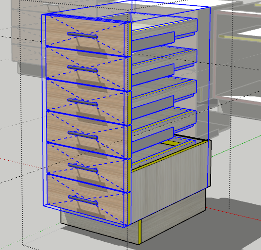
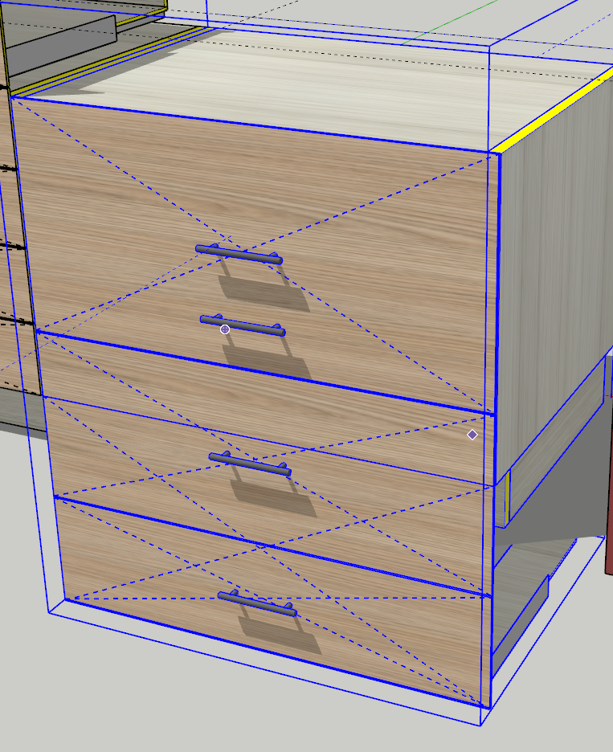

1. CUANDO PONGO N CAJONES Y UNA ALTURA PEQUEÑA (600MM DE ALTO) LA TRASPAZA POR ARRIBA, YA QUE LA ALTURA DE LOS N CAJONES SE ASIGNA MEDIANTE ESTA FORMULA EN v01altocajon1: =(LenZ-f02sepcajtirad*(a21cantcajon-1))/a21cantcajon

2. CUANDO PONGO 4 CAJONES EN UN GABINETE DE 600MM DE ALTO Y EL PRIMERO LO PONGO EN G LOS DEMAS SE PASAN Y TRASPASAN LA PARTE INFERIOR 

3. Los demas campos para poner la altura de los cajones no tienen la opcion de G/CH/PERSONALIZADO

4. Agrega logo.jpg en la esquina donde actualmente hay un cuadro rojo y cambia el color del tema general de la interfaz a #59b4a5 
