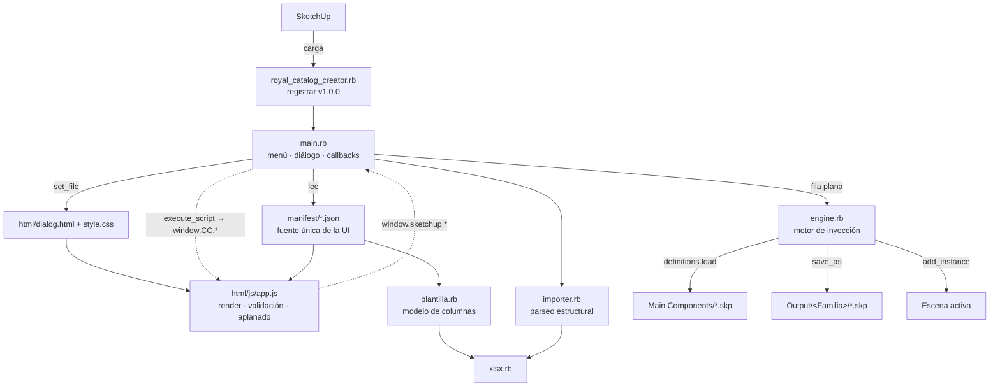
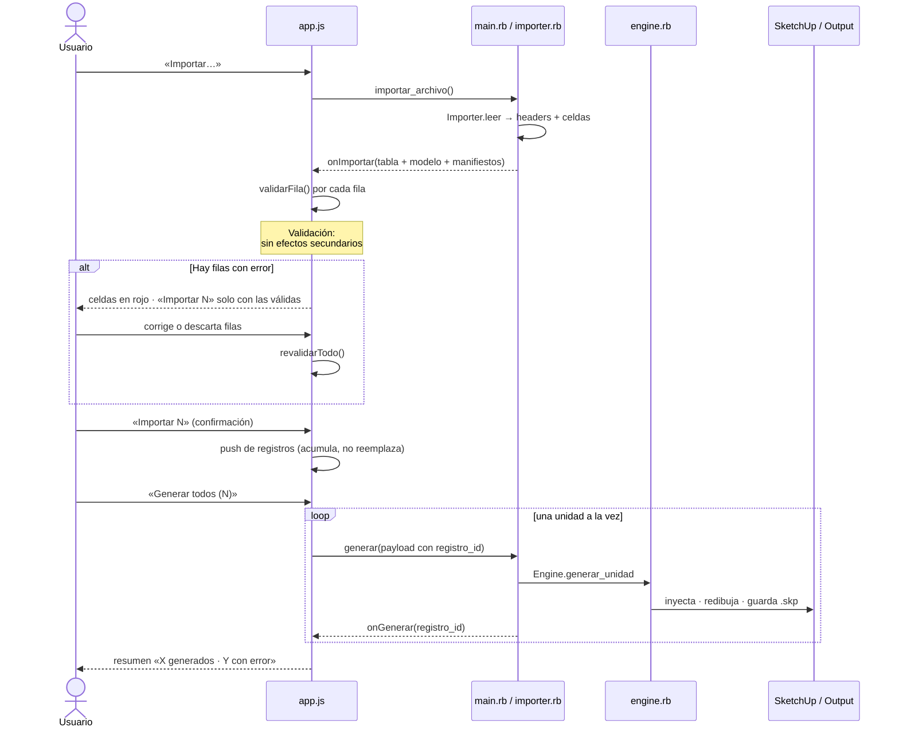

# Manual técnico — Royal Catalog Creator

**Proyecto:** KitchenCreator / Royal Catalog Creator · **Versión:** 1.0.0 (`plugin/royal_catalog_creator.rb:18`)
**Audiencia:** dirección, operaciones y TI de Royal Kitchens, más el desarrollador que retome el proyecto.

## Tabla de contenido

1. [Resumen ejecutivo](#1-resumen-ejecutivo) · 2. [Contexto y problema de negocio](#2-contexto-y-problema-de-negocio) · 3. [Impacto y valor](#3-impacto-y-valor) · 4. [Arquitectura del sistema](#4-arquitectura-del-sistema) · 5. [Flujo funcional de punta a punta](#5-flujo-funcional-de-punta-a-punta) · 6. [Modelo de datos y diccionario de variables](#6-modelo-de-datos-y-diccionario-de-variables) · 7. [Instalación y despliegue](#7-instalación-y-despliegue) · 8. [Operación](#8-operación) · 9. [Referencia técnica para desarrollo](#9-referencia-técnica-para-desarrollo) · 10. [Problemas conocidos y limitaciones](#10-problemas-conocidos-y-limitaciones) · 11. [Riesgos operativos y mitigación](#11-riesgos-operativos-y-mitigación) · 12. [Roadmap y siguientes pasos](#12-roadmap-y-siguientes-pasos) · 13. [Glosario](#13-glosario) · 14. [Anexo: mapa de archivos](#14-anexo-mapa-de-archivos-del-repositorio)

---

## 1. Resumen ejecutivo

Royal Catalog Creator es una herramienta que se instala dentro de SketchUp y permite que una diseñadora genere por sí misma las variaciones del catálogo de Royal Kitchens: gabinetes, alacenas y esquineros. Se abre una ventana, se elige el tipo de mueble, se llenan medidas y opciones en un formulario, y la herramienta produce el archivo del mueble terminado y, si se pide, lo coloca en el plano que se está trabajando.

El problema que resuelve es de dependencia técnica. Antes, cada variación salía de llenar una hoja de cálculo con nombres de columna crípticos y de ejecutar a mano una instrucción en una consola de programación dentro de SketchUp. Ese formato solo lo entendía quien había escrito el programa: la diseñadora no podía capturar sin ayuda y los errores se descubrían al final, con los muebles ya generados.

Hoy hay dos caminos, ambos operativos. El principal es visual: se crean los módulos en la ventana de la herramienta, con desplegables que solo ofrecen valores válidos. El segundo es masivo: la herramienta exporta una plantilla de Excel ya armada, alguien la llena fuera de línea, y al importarla el sistema revisa fila por fila y muestra el resultado en una tabla. Nada se crea hasta que quien opera confirma.

El estado es de primera versión completa y en uso: las tres familias están activas, la generación individual y por lote funcionan, y el repositorio conserva evidencia de corridas reales. Sigue abierto lo relativo al esquinero —la familia más compleja, con dos alas y repisas en L— y varios valores de referencia que dependen de producción, no del programa.

Lo que se gana: la captura deja de exigir perfil técnico, los errores se detectan antes de generar, agregar una variable ya no requiere reprogramar, y un lote completo corre desatendido en una sola orden.

---

## 2. Contexto y problema de negocio

El catálogo se arma sobre tres muebles base paramétricos —gabinete, alacena y esquinero—, modelos que se reconstruyen solos cuando cambian sus medidas y opciones. Producir catálogo es aplicar cientos de combinaciones de esos valores y guardar cada resultado.

**Proceso anterior.** Las combinaciones se capturaban en una hoja cuyos encabezados eran los nombres internos del modelo, no palabras del oficio: el tipo de tirador vivía en una columna llamada `puerta>f21tipotirador`, y para omitir una variable había que escribir la palabra «no» en la celda, convención inventada por quien programó el script y no documentada para quien capturaba. Después había que abrir la consola de programación de SketchUp y pegar una instrucción con la ruta exacta del archivo. Cualquier falla —ruta equivocada, modelo base ausente, celda imposible— aparecía a media corrida y en lenguaje técnico.

**Por qué era una barrera.** El perfil que necesita el catálogo es de diseño, no de programación. Exigirle nombres de variables internas y una consola convierte una tarea de diseño en una de sistemas: en la práctica el catálogo dependía de una sola persona capaz de correrlo.

**Extensión actual.** El formulario muestra los mismos parámetros con nombres legibles —«Diseño de puerta», «Alto zócalo», «Cantidad de divisores»— y listas cerradas de opciones válidas; lo imposible se bloquea antes de generar. Para quien prefiere Excel, la herramienta produce ella misma la plantilla, de modo que la hoja encaja por construcción y no por memoria del capturista. La consola desaparece del proceso.

---

## 3. Impacto y valor

La diferencia no está en la velocidad de la máquina —el motor que aplica los valores es en esencia el mismo—, sino en quién puede operarla, cuándo se detectan los errores y qué cuesta agregar algo nuevo.

| Dimensión | Proceso anterior | Proceso actual |
|---|---|---|
| **Pasos del lote** | Llenar hoja técnica → verificar rutas → abrir consola → pegar instrucción → leer mensajes | Abrir la herramienta → capturar → revisar tabla de validación → confirmar → generar todos |
| **Perfil requerido** | Convención interna de variables y consola de programación | Diseño; sin conocimientos técnicos |
| **Detección de errores** | Durante o después de la corrida | Antes de generar: por campo y fila por fila |
| **Puntos de falla** | Ruta a mano, archivo base equivocado, convención oculta, cero validación de captura | Carpeta del proyecto mal configurada (con aviso); mueble base ausente o alterado |
| **Variable nueva** | Columna en la hoja más cambio de programa | Se declara en la configuración de su familia; aparece sola en formulario y plantilla |
| **Escalabilidad** | Una corrida por archivo, sin avance visible ni recuperación | Lote secuencial con avance, cancelación entre unidades y fallas que no abortan el resto |


*Figura 1 — Evidencia de que el lote llega hasta el final: los módulos quedan construidos en la escena y registrados como componentes con su nombre de catálogo, no como geometría suelta.*

Las cifras que darían la medida completa del ahorro no están en el repositorio y no se inventan aquí: `[por confirmar: tiempo promedio por módulo antes y ahora]`, `[por confirmar: volumen mensual de variaciones requerido]`, `[por confirmar: personas capacitadas hoy para operar la herramienta]`. Sí es verificable la salida acumulada: 33 muebles generados —17 gabinetes, 8 alacenas, 8 esquineros—.

---

## 4. Arquitectura del sistema

Extensión de SketchUp en Ruby con interfaz HTML embebida. La separación es estricta: **Ruby toca el modelo 3D y el disco; JavaScript resuelve la semántica del formulario**; se comunican por un puente de mensajes.

### 4.1 Responsabilidad de cada archivo `.rb`

| Archivo | Responsabilidad |
|---|---|
| `plugin/royal_catalog_creator.rb` | Registrar que SketchUp descubre: nombre, versión `1.0.0`, autor; delega en `main.rb` (`:20-28`). |
| `royal_catalog_creator/main.rb` | Capa de aplicación: menú y barra (`:401-418`), diálogo (`:71-92`), familias activas (`:23-27`), carpeta del proyecto (`:39-66`), los seis callbacks del puente (`:94-127`), manifiestos (`:138-149`), orquestación de la generación (`:315-396`) y espejo en Ruby del presupuesto de cajones (`:252-304`). |
| `royal_catalog_creator/engine.rb` | Único módulo que modifica geometría: unidades a pulgadas (`:31-57`), búsqueda de piezas hijas (`:63-80`), escritura de atributos (`:87-120`), borrado de piezas ocultas (`:137-173`), nombrado de divisiones (`:199-223`), fusión de entrepaños (`:262-286`) y ciclo completo de una unidad (`:405-486`). |
| `royal_catalog_creator/plantilla.rb` | Modelo de columnas derivado de los manifiestos (`:42-83`): qué campos comparten columna y qué prefijo lleva cada encabezado (`:90-131`). |
| `royal_catalog_creator/xlsx.rb` | Escritor y lector mínimo de `.xlsx` sin gems: escribe con entradas de zip sin comprimir (`:38-50`, `:389-422`) y lee descomprimiendo con `zlib` (`:217-294`). |
| `royal_catalog_creator/importer.rb` | Solo parseo estructural (`:26-54`); detecta CSV en Windows-1252 (`:62-70`), deduce el separador (`:74-77`), topa en 500 filas (`:22`). |

`script.rb` e `introspeccion.rb`, en la raíz, no forman parte de la extensión (ver §9).

### 4.2 Capa HTML/JS y puente

`html/dialog.html` define barra lateral, panel central que alterna entre estado vacío, editor e importación (`dialog.html:55-113`) y dos modales propios. No contiene marcado de formulario: los campos los dibuja `app.js` desde el manifiesto (`app.js:440-549`).

El puente es explícito: **JS → Ruby** con `window.sketchup.<callback>()` sobre seis callbacks —`sync`, `get_manifest`, `elegir_carpeta`, `generar`, `exportar_plantilla`, `importar_archivo` (`main.rb:94-127`)—; **Ruby → JS** con `dialog.execute_script("window.CC.<fn>(<json>)")` (`main.rb:130-133`) sobre cinco receptores (`app.js:1539-1621`). `app.js:12-19` sustituye el objeto del puente por uno inocuo para poder abrir la interfaz fuera de SketchUp durante el desarrollo. Al ser asíncrono, el lote debe ser secuencial: cada unidad se manda cuando llega la respuesta de la anterior (`app.js:1026-1037`).

### 4.3 Manifiestos e integración con SketchUp

Cada familia tiene su JSON en `manifest/`, que declara mueble base, carpeta de salida, grupos de campos y reglas especiales. **El motor es agnóstico a la familia**: no hay condicionales por tipo de mueble en el código. La integración ocurre en tres puntos: la definición base se carga desde archivo (`main.rb:347`), los valores se escriben en el diccionario `dynamic_attributes` de cada pieza objetivo (`engine.rb:104-117`) y el redibujado se fuerza llamando al observador de componentes dinámicos (`engine.rb:426`).



---

## 5. Flujo funcional de punta a punta

### 5.1 Punto de entrada

Al cargar, `app.js` pide `sync` (`app.js:1668`) y Ruby responde con familias activas, ruta del proyecto y si es válida (`main.rb:95-101`). Si no lo es, la interfaz avisa y pide señalar la carpeta correcta (`app.js:1546-1548`).


*Figura 2 — La sesión arranca vacía y con estado explícito: las tres vías de captura conviven en la misma barra y la carpeta del proyecto se muestra siempre, porque de ella depende que algo se pueda generar.*

### 5.2 Vía visual

1. **+ Nuevo módulo** abre el selector de familia; al elegir una, `app.js` pide su manifiesto (`app.js:1531-1534`) y con él arma formulario, valores por omisión y nombre automático (`app.js:345-372`).
2. Al generar, el registro se aplana a pares `atributo → valor` respetando visibilidad y habilitación (`app.js:867-881`) y viaja a Ruby con el identificador del registro y los dos interruptores de sesión (`app.js:945-958`).
3. Ruby valida el presupuesto de cajones (`main.rb:335-338`) y llama al motor (`main.rb:379`), que inserta una copia independiente, inyecta valores, fuerza el redibujado, nombra divisiones, fusiona mitades si aplica, borra piezas ocultas, guarda el `.skp` y solo conserva la instancia en escena si se pidió (`engine.rb:405-486`).


*Figura 3 — El formulario es un render del manifiesto: secciones, etiquetas legibles y el juego completo de opciones del desplegable salen del archivo de configuración de la familia, así que ampliar el catálogo no obliga a modificar el programa.*

### 5.3 Vía masiva, en tres etapas

**1 · Selección.** «Importar…» solo procede con carpeta válida (`app.js:1452-1456`). Ruby abre el explorador acotado a `.xlsx`, `.csv` y `.txt` (`main.rb:199`), `importer.rb` entrega la matriz de texto y `main.rb` adjunta el modelo de columnas y los tres manifiestos completos en la misma respuesta (`main.rb:205-209`).

**2 · Validación previa, sin efectos secundarios.** `app.js` valida cada fila (`app.js:1180-1255`) con los mismos predicados del formulario: familia reconocida, nombre válido y no repetido —ni en el archivo ni contra la sesión—, opciones existentes en el manifiesto de esa familia, medidas parseables, requeridos presentes, presupuesto de cajones factible. Cada celda se marca como error o aviso y editarla revalida en vivo (`app.js:1408-1414`). Aquí **no se crea nada**: ni geometría, ni archivos, ni registros.

**3 · Confirmación.** Solo al pulsar «Importar N» las filas buenas se vuelven registros. La operación es **acumulativa, no destructiva**: se agregan al final de la lista existente (`app.js:1467-1473`), así que los módulos previos —capturados a mano o importados antes— siguen ahí, en estado de borrador.


*Figura 4 — La importación interpone una validación completa antes de cualquier efecto: el resumen cuenta filas listas y con error, el botón indica cuántas entrarán, y las celdas de columnas ajenas a la familia de la fila aparecen atenuadas con la marca «no aplica a esta familia».*



---

## 6. Modelo de datos y diccionario de variables

### 6.1 Manifiesto

Cada manifiesto declara la identidad de la familia (`manifest/gabinete.json:2-7`):

```json
{ "familia": "gabinete", "titulo": "Gabinete",
  "componente_base": "Main Components/GABINETE.skp",
  "salida_dir": "Output/Gabinetes",
  "nombre_patron": "GAB-{LenX}-{divisor>f01cantdiv}div" }
```

Debajo van los `grupos` —Dimensiones, Espesores, Estructura e interior, Frente y puertas, Tirador, Cajones, Divisores— y sus `campos`, con `id`, `attr`, `label`, `tipo`, `unidad` y `default`. Hay cuatro tipos de control: `numero`, `select`, `preset` (estándares más medida libre) y `derivado` (contador que activa N subcampos). Se suman bloques de reglas por familia: `reglas_divisores` (`gabinete.json:8-14`), `reglas_cajones` (`:15-26`) y `reglas_union`, exclusivo de Esquinero (`esquinero.json:8-12`).

### 6.2 Notación `prefijo>atributo` y unidades

Un atributo sin prefijo se escribe en la raíz del módulo; con `>` se escribe en todas las piezas hijas cuyo nombre contenga el prefijo (`engine.rb:91-100`). Así `LenX` es el ancho del mueble y `divisor>f03espacio1` la altura del primer espacio interior.

La unidad del campo se concatena en la interfaz (`app.js:65-82`) y el motor convierte `mm`, `cm`, `m` e `in` a pulgadas, unidad nativa de SketchUp (`engine.rb:36-53`). Se conservan dos convenciones heredadas: celda vacía significa «no tocar la variable» y el texto `no` significa «omitir explícitamente» (`engine.rb:33-34`). Convención propia de esta versión: **el formulario captura la medida del cuerpo, no la total**; el manifiesto declara qué se suma antes de inyectar —zócalo al alto, espesor de puerta a la profundidad y solo con puerta exterior— y la interfaz muestra el total resultante (`gabinete.json:33-41`, `app.js:89-118`).

### 6.3 Reglas condicionales

La habilitación es **por campo** y es dato del manifiesto, incluido el texto que ve el usuario. Fragmento literal de `manifest/gabinete.json:201`:

```json
"habilitado_si": { "attr": "divisor>f02tipomedida", "valor": "2",
                   "mensaje": "Solo aplica con tipo de medida «Personalizado»." }
```

El código solo lo pinta (`app.js:535-537`) y una regla de estilo lo oculta cuando el campo sí está activo. La misma declaración cubre los 21 campos de espacio de las tres familias, y el predicado que la evalúa es único (`app.js:176-189`), compartido con las condiciones de las sumas. Existe además `visible_si`, que oculta en vez de deshabilitar.


*Figura 5 — Las reglas del manifiesto se materializan en el formulario con su texto original: lo que la configuración desactiva queda a la vista y anotado, pero no entra en la fila que se inyecta. La barra lateral muestra además el resultado acumulativo de la importación.*

### 6.4 Plantilla y prefijos de aplicabilidad

La plantilla se deriva de los manifiestos (`plantilla.rb:42-83`). La regla clave: **la columna se identifica por el campo completo, no por el atributo**; dos familias la comparten solo si coinciden atributo, tipo, unidad, etiqueta y el juego entero de opciones (`plantilla.rb:90-94`). Si algo difiere, la columna se parte y el encabezado declara a qué familias aplica con las siglas `GAB`, `ALA`, `ESQ` (`plantilla.rb:32`, `:113`); sin prefijo vale para las tres. Encabezados reales de `Input/variaciones_20.xlsx`:

| Encabezado | Aplica a | Por qué |
|---|---|---|
| `Alto (mm)` | Las tres | Mismo campo en todo |
| `[GAB·ALA] Ancho (mm)` | Gabinete y Alacena | En Esquinero es «Ancho izquierdo» |
| `[GAB·ESQ] Alto zócalo (mm)` | Gabinete y Esquinero | La alacena no lleva zócalo |
| `[GAB] Diseño de puerta` | Gabinete | Su lista llega a «4 cajones»; la de Esquinero corta antes |
| `[ESQ] Profundidad izquierda (mm)` | Esquinero | Cada ala tiene profundidad propia |

El archivo generado tiene 62 columnas. Al importar, el encabezado es la llave: coincidencia exacta o, con encabezados crudos del formato viejo, resolución por atributo según la familia de la fila (`app.js:1114-1132`). Las celdas de columnas que no aplican se atenúan con «No aplica a esta familia» (`app.js:1435-1438`) y, si traen dato, se avisa y se ignoran (`app.js:1218-1221`).

> ⚠️ Discrepancia: `SCOPE.md:110-118` declara un `manifest/_comunes.json` con campos compartidos por `$ref`; el repositorio solo tiene los tres manifiestos por familia, autocontenidos, y `main.rb:138-149` no resuelve referencias entre archivos.

> ⚠️ Discrepancia: `SCOPE.md:223` reporta 64 columnas y 18 listas; `Definiciones/PLANTILLA.md:49` reporta 62 y 17, que es lo que produce el código vigente tras excluir los dos interruptores de sesión (`plantilla.rb:75-78`).

---

## 7. Instalación y despliegue

**Requisitos.** SketchUp de escritorio con `UI::HtmlDialog` y componentes dinámicos. `[por confirmar: versión mínima soportada; el repositorio solo cita la ruta de plugins de SketchUp 2023 en plugin/README.md:172]`. **SketchUp Pro** hace falta solo para fusionar las mitades de entrepaño del Esquinero; sin Pro el mueble se genera igual y sale un aviso (`engine.rb:268-270`). Y la carpeta del proyecto con `Main Components/` y sus tres archivos base.

**Instalación.** El distribuible es `dist/royal_catalog_creator.rbz` (100 KB, 13 entradas), desde *Extensiones ▸ Administrador de extensiones ▸ Instalar extensión*; alternativamente se copian `royal_catalog_creator.rb` y su carpeta a la carpeta de plugins.


*Figura 6 — Verificación de instalación: la extensión queda registrada a nombre de Royal Kitchens y activada, con la leyenda «Sin firmar». Se confirmó inspeccionando el paquete, cuyas 13 entradas son código, manifiestos y recursos, sin ninguna firma digital de Trimble.*

**Registro en el menú.** `main.rb:402-403` registra un **elemento simple** (`menu.add_item`) y, aparte, una barra de herramientas propia (`main.rb:405-415`). No hay submenú en el código: si el sistema lo muestra con flecha, es agrupamiento del propio menú de SketchUp. El icono solo se asigna si el archivo existe (`main.rb:409-413`); en el repositorio no está, así que el botón sale sin gráfico.

**Carpeta del proyecto.** Se resuelve en tres pasos (`main.rb:39-48`): preferencia guardada si sigue siendo válida, deducción desde la ubicación del plugin, o la última conocida aunque no sirva. Si es inválida, la interfaz avisa al abrir y **las tres operaciones de disco quedan bloqueadas** con el mismo mensaje —«Configura primero la carpeta del proyecto (contiene «Main Components»)»—: generar (`main.rb:326-329`), exportar plantilla (`:165-167`) e importar (`:193-195`), con bloqueo espejo en la interfaz (`app.js:930-933`, `:1452-1456`). «Cambiar carpeta…» rechaza cualquier carpeta sin `Main Components` (`main.rb:60-63`) y recuerda la elección. Es un punto único de falla: la validez se comprueba solo por la existencia del directorio, no por la integridad de los `.skp`.

**Reconstruir el paquete.** `plugin/build.ps1` arma el `.rbz` en un área temporal y escribe las entradas del zip a mano para forzar `/` como separador, requisito del instalador (`build.ps1:38-61`). Para publicar: subir `VERSION` en `royal_catalog_creator.rb:18`, ejecutar el script, distribuir el `.rbz`.

---

## 8. Operación

**Generación individual.**

1. Abrir SketchUp y entrar a **Extensiones ▸ Royal Catalog Creator**.
2. Verificar al pie de la barra izquierda la **carpeta del proyecto**; si hay aviso, usar **Cambiar carpeta…** y señalar la que contiene «Main Components».
3. Pulsar **+ Nuevo módulo** y elegir Gabinete, Alacena o Esquinero.
4. Escribir el nombre —el sistema propone uno— y recorrer las secciones ajustando medidas y opciones. Lo que la configuración no usa queda atenuado con su razón escrita debajo.
5. Decidir los dos interruptores: **Insertar en escena** coloca el mueble en el plano además de guardar el archivo; **Limpiar piezas ocultas**, encendido por omisión, deja el archivo como pieza final: más ligero, ya no reconfigurable.
6. Pulsar **Generar**: el archivo queda en la carpeta de salida de esa familia y, si se pidió, el mueble aparece en la escena.


*Figura 7 — Salida de una generación individual: el mueble se inserta como componente con su nombre de catálogo y queda a la vez guardado como archivo reutilizable en la carpeta de su familia.*

**Generación masiva.**

1. Pulsar **Plantilla…** y guardar el Excel que ofrece.
2. Llenar la hoja **Modulos** fuera de línea, una fila por mueble. Las tres primeras filas son ejemplos sobrescribibles. Las columnas sin prefijo aplican a las tres familias; las que empiezan con `[GAB]`, `[ALA]` o `[ESQ]`, solo a esas. Las medidas van sin unidad, las opciones se eligen del desplegable y la celda vacía toma el valor por omisión. La hoja **Instrucciones** trae esta guía dentro del archivo (`plantilla.rb:209-232`).
3. Pulsar **Importar…** y elegir el archivo; también se acepta CSV.
4. Revisar la tabla: cada fila muestra su estado, el resumen cuenta listas y con error, y cada celda con problema se corrige ahí mismo. **Nada se ha creado todavía**: se pueden descartar las filas con error o cancelar todo.
5. Pulsar **Importar N**. Los módulos **se agregan** a los que ya hubiera: si antes se capturó uno a mano, tras importar veinte la lista tendrá veintiuno.
6. Pulsar **Generar todos (N)** y confirmar. Corre de uno en uno con avance visible; cancelar detiene la cola al terminar la unidad en curso, nunca a media construcción. Una falla marca ese módulo y el resto continúa.

Advertencia: regenerar un módulo **sobrescribe** su archivo de salida; la confirmación del lote lo indica (`app.js:1009-1010`).

---

## 9. Referencia técnica para desarrollo

### 9.1 Puntos de extensión

| Cambio | Qué tocar |
|---|---|
| **Agregar una variable existente en el componente** | Solo el manifiesto de la familia: un objeto en `campos` con `id`, `attr`, `label`, `tipo`, `unidad`, `default`. Aparece sola en el formulario y en la plantilla. Cero código. |
| **Agregar una opción a un desplegable** | El arreglo `opciones` (o `presets`) del campo: `label` legible más `valor` que espera el componente. |
| **Condicionar un campo a otro** | `habilitado_si` (deshabilita y muestra su `mensaje`) o `visible_si` (oculta). El predicado admite `valor`, `valores` o `excepto` (`app.js:176-183`). |
| **Compensar una medida** | Bloque `suma` en el campo, con condiciones `si` por sumando; se resuelve en `effectiveValue` (`app.js:89-99`), no en el aplanado. |
| **Agregar una familia** | Crear `manifest/<familia>.json`, colocar su `.skp` en `Main Components/` y añadir la entrada a `FAMILIAS` (`main.rb:23-27`). |
| **Cambiar el mínimo de alto de cajón** | `reglas_cajones` del manifiesto; es dato, pero la regla está implementada dos veces (§10). |
| **Nueva regla geométrica post-generación** | Código en `engine.rb` más su bloque declarativo en el manifiesto, como se hizo con `reglas_union`. |

### 9.2 Scripts de diagnóstico (`Issues/`)

Sondas de un solo uso, fuera del paquete distribuible, para responder desde dentro de SketchUp lo que no se puede leer de un `.skp` desde fuera.

- `diag_divisores.rb` — determinó el nodo hoja de cada división, si las copias comparten definición y su orden respecto a los índices de margen; de ahí el ordenamiento por `z` de `engine.rb:208-210`.
- `diag_entrepanos.rb` — localizó el contenedor real de las repisas del Esquinero y probó que cada mitad no es sólido cerrado por traer colgando un grupo auxiliar; de ahí la técnica de unir copias limpias (`engine.rb:361-377`).
- `diag_union.rb` — sonda abierta: aísla en qué etapa se pierden los entrepaños, corriendo el flujo real dentro y fuera de una operación de modelo y contando piezas entre etapas.

### 9.3 `introspeccion.rb`

Inserta temporalmente el componente base y recorre su jerarquía volcando, por variable y por pieza, valor, metadatos (`_label`, `_units`, `_access`, `_options`) y el texto completo de la fórmula (`introspeccion.rb:57-106`), a `introspeccion_dump.txt` (2 MB). Formato: árbol indentado.

```
  [RAIZ > 1]  BoxModulo  (def: Grupo#173)
    - lenx = 15.748031496062993  <FÓRMULA>
        access=(NONE/no def)  units=-
        label="LenX"  formlabel="-"
```

Sirve para descubrimiento administrativo, no como fuente de interfaz: el volcado del gabinete arrojó 325 variables únicas, cerca de la mitad con fórmula —plomería interna— y 333 entradas que son separadores decorativos (`SCOPE.md:55-62`). Ninguna trae etiquetas ni unidades curadas, y por eso el manifiesto es obligatorio.

---

## 10. Problemas conocidos y limitaciones

**Del componente base.** La fórmula que reparte el alto entre cajones no tiene piso: si el reparto queda bajo el mínimo físico, el componente recorta y la pila traspasa el mueble. El plugin lo bloquea calculando el presupuesto antes de generar, pero es compensación externa, no corrección del modelo. El mínimo usado, 100 mm, es un valor pedido y no medido (`plugin/README.md:288-290`). `divisor>f03espacio7` es inalcanzable: exige siete divisores y el contador topa en seis (`plugin/README.md:291-293`).

**Del Esquinero.** La fusión de mitades exige SketchUp Pro; sin Pro quedan separadas con un aviso (`engine.rb:268-270`). Hay un problema abierto en `Issues/diag_union.rb:16-27`: tras la unión, la cantidad de entrepaños queda en 1 y sus márgenes no se aplican; la sospecha es que las Solid Tools abren su propia operación de modelo dentro de la de generación. El material sin aplicar ya se corrigió; los otros dos síntomas siguen en diagnóstico.

**Del diseño del sistema.**

- **La regla de cajones está implementada dos veces**, en JavaScript y en Ruby (`app.js:233-327`, `main.rb:252-304`); ambos archivos lo declaran como espejo a mantener sincronizado. Es deuda asumida: por no crear un tercer espejo, el importador se dejó sin semántica.
- **Limpiar piezas ocultas es irreversible** para el archivo generado, igual que la fusión de entrepaños.
- **La salida se sobrescribe sin versionar**: generar dos veces el mismo nombre reemplaza el archivo anterior.
- **Los interruptores de escena y limpieza son estado de sesión**, no del módulo; el lote aplica a todas las unidades los que estén puestos.
- **Tope de 500 filas por importación** (`importer.rb:22`), con aviso si se recorta.
- **Leer `.xlsx` depende de `zlib`**; sin él, el mensaje redirige a CSV (`xlsx.rb:284-288`).
- **No hay pruebas automatizadas** en el repositorio: ni suite, ni integración continua, ni ganchos de verificación.
- **El auto-acomodo en escena tiene preguntas abiertas**: punto de origen, separación entre unidades y dirección del avance (`SCOPE.md:242-243`).

> ⚠️ Discrepancia: `SCOPE.md:178` fija `GABINETE.skp` como base vigente, pero `script.rb:12` sigue apuntando a `GabineteBase.skp` y a rutas absolutas de otra carpeta. El script legado no se actualizó; el plugin sí usa la ruta correcta vía manifiesto.

> ⚠️ Discrepancia: `SCOPE.md:237` declara que Alacena y Esquinero van «como stubs» hasta recibir definiciones del mantenedor; el código las tiene activas (`main.rb:23-27`) y ambas cuentan con manifiesto completo.

---

## 11. Riesgos operativos y mitigación

| Riesgo | Impacto | Probabilidad | Mitigación propuesta |
|---|---|---|---|
| **Extensión sin firma digital** | Alto — según el nivel de seguridad configurado, SketchUp puede impedir su carga y dejar sin herramienta al área | Media | Documentar el ajuste de seguridad requerido por equipo; evaluar el proceso de firma con el proveedor para eliminar la excepción |
| **Dependencia de personal clave** | Alto — el conocimiento del funcionamiento interno está concentrado | Media | Este manual más una sesión de transferencia; formalizar un segundo responsable capaz de reconstruir y publicar el paquete |
| **Dependencia de SketchUp y su versión** | Alto — un cambio de versión puede afectar la ventana embebida o el comportamiento de los muebles paramétricos | Media | Fijar la versión soportada; probar cada actualización aislada antes de desplegarla y no actualizar durante corridas |
| **Funciones que exigen la edición Pro** | Medio — sin Pro los esquineros salen con las repisas partidas | Media | Reservar al menos una licencia Pro para esquineros; el aviso ya alerta |
| **Muebles base sin versionar ni proteger** | Alto — son la fuente de verdad del catálogo; una modificación accidental se propaga a todo lo generado después, sin alarma | Alta | Control de versiones o resguardo de solo lectura; registrar y aprobar cualquier cambio a los modelos |
| **Dependencia de la carpeta del proyecto** | Alto — moverla o renombrarla deja el sistema inoperante | Alta | Ruta estándar única para el área; ampliar la validación a la presencia de los tres archivos base |
| **Sin pruebas automatizadas** | Medio — todo cambio se verifica a mano y una regresión puede pasar inadvertida | Alta | Juego mínimo de casos de referencia por familia, comparados antes de cada publicación |
| **Reglas de validación duplicadas** | Medio — corregir solo una permite aceptar configuraciones que luego fallan | Media | Verificar ambas implementaciones en toda revisión que toque esa regla |
| **Salida sobrescrita sin historial** | Medio — una corrida equivocada reemplaza archivos buenos | Media | Respaldo periódico de la carpeta de salida o nombres con fecha de corrida |

---

## 12. Roadmap y siguientes pasos

| Iniciativa | Beneficio de negocio | Esfuerzo |
|---|---|---|
| Cerrar los problemas abiertos del esquinero (entrepaños y sus márgenes) | Habilita la tercera familia con la misma confianza que las otras dos | Medio |
| Confirmar con producción los valores pendientes (mínimo de alto de cajón, medidas estándar, polaridad de algunas opciones) | Elimina supuestos; evita catálogo con medidas que el herraje no admite | Bajo |
| Casos de prueba por familia verificados antes de cada publicación | Reduce regresiones y permite liberar sin depender de la memoria del programador | Medio |
| Resolver el acomodo automático en escena (origen y separación) | Hace predecible el armado de corridas completas | Bajo |
| Poner los muebles base bajo control de versiones | Protege la fuente de verdad del catálogo | Bajo |
| Editar un mueble ya generado recuperando sus valores | Permite ajustar una variación sin recapturarla | Alto |
| Generación de series por barrido de una dimensión | Multiplica el volumen de catálogo por unidad de captura | Medio |
| Incorporar piezas fuera de catálogo al armado | Cierra el flujo de una cocina completa, no solo de módulos estándar | Alto |
| Firma digital del paquete | Elimina fricción y riesgo de instalación en equipos restrictivos | Medio |

---

## 13. Glosario

| Término | Significado |
|---|---|
| **Componente dinámico** | Modelo de SketchUp que se reconstruye solo al cambiar sus parámetros. |
| **Definición** | El «molde» de un componente; existe una vez aunque aparezca muchas. |
| **Instancia** | Cada aparición concreta de una definición en la escena. |
| **Atributo dinámico** | Parámetro guardado dentro del componente; es lo que el sistema escribe. |
| **Fórmula** | Cálculo interno que deriva un valor de otros; plomería del modelo, no dato de usuario. |
| **Módulo** | Mueble configurado de la sesión, con nombre y valores; equivale a una fila de captura. |
| **Familia** | Tipo de mueble base: Gabinete, Alacena o Esquinero. |
| **Manifiesto** | Configuración por familia: qué parámetros se muestran, cómo se llaman, qué admiten. |
| **Fila plana** | Pares parámetro-valor finales que se inyectan al mueble. |
| **Zócalo** | Base o rodapié del mueble; se suma al alto del cuerpo. |
| **Ceja** | Remate del frente; el gabinete admite llevarla o no. |
| **Entrepaño** | Repisa horizontal interior. |
| **Divisor** | Separación interior que parte el mueble en espacios; se distingue del entrepaño por su remate frontal. |
| **Tirador** | Jaladera de puerta o cajón: tipo, posición y orientación. |
| **Amarre** | Travesaño estructural que une los costados en la parte superior. |
| **Esquema (Outliner)** | Panel de SketchUp que lista jerárquicamente los componentes de la escena. |
| **Solid Tools** | Operaciones booleanas de SketchUp, exclusivas de la edición Pro. |
| **Paquete `.rbz`** | Formato de instalación de extensiones de SketchUp. |

---

## 14. Anexo: mapa de archivos del repositorio

| Ruta | Propósito |
|---|---|
| `plugin/royal_catalog_creator.rb` | Registrar de la extensión. |
| `plugin/royal_catalog_creator/main.rb` | Menú, diálogo, callbacks, carpeta del proyecto, generación. |
| `plugin/royal_catalog_creator/engine.rb` | Motor de inyección y post-procesos geométricos. |
| `plugin/royal_catalog_creator/plantilla.rb` | Modelo de columnas de la plantilla. |
| `plugin/royal_catalog_creator/xlsx.rb` | Lector y escritor de `.xlsx` sin dependencias. |
| `plugin/royal_catalog_creator/importer.rb` | Parseo estructural de CSV/XLSX. |
| `plugin/royal_catalog_creator/manifest/*.json` | Manifiestos de las tres familias: campos, opciones, reglas. |
| `plugin/royal_catalog_creator/html/dialog.html` | Estructura de la interfaz. |
| `plugin/royal_catalog_creator/html/js/app.js` | Render, reglas condicionales, presupuesto, validación, lote, puente. |
| `plugin/royal_catalog_creator/html/css/style.css` | Estilos, incluida la regla del mensaje condicional. |
| `plugin/royal_catalog_creator/html/img/logo.jpg` | Logotipo de la barra lateral. |
| `plugin/build.ps1` | Empaquetado del `.rbz`. |
| `plugin/README.md` | Mantenimiento del plugin y notas pendientes. |
| `dist/royal_catalog_creator.rbz` | Paquete distribuible. |
| `Main Components/*.skp` | Componentes base; fuente de verdad de la geometría. |
| `Output/<Familia>/` | Muebles generados, una carpeta por familia. |
| `Input/` | Capturas de entrada (`variaciones_20.xlsx`, `Gabinetes.csv`, históricos). |
| `Definiciones/LEEME.md` | Cómo declarar las variables que expone cada familia. |
| `Definiciones/PLANTILLA.md` | Diseño de la plantilla: columnas, celdas, formato. |
| `Definiciones/*.csv` | Diccionario de variables por familia. |
| `SCOPE.md` | Alcance, decisiones fechadas y preguntas abiertas. |
| `script.rb` · `Command.txt` | Script legado y su instrucción de consola. |
| `stepts.md` | Plan de trabajo inicial. |
| `introspeccion.rb` · `introspeccion_dump.txt` | Volcado de atributos y fórmulas, y su resultado. |
| `Issues/errors.md` | Bitácora de incidencias y su resolución. |
| `Issues/diag_*.rb` | Sondas de diagnóstico, fuera del paquete. |
| `capturas/` · `README.md` | Capturas del sistema en operación; descripción del repositorio. |
