# Royal Catalog Creator — Manual de usuario

**Sistema:** Royal Catalog Creator (extensión para SketchUp)
**Versión de la extensión:** 1.0.0
**Fecha del documento:** 3 de agosto de 2026
**Publica:** Royal Kitchens

**Destinatarios**

| Público | Para qué le sirve |
|---|---|
| Diseñadoras de cocina | Procedimiento completo de captura y generación de módulos de catálogo. |
| Dirección, Operaciones y TI | Evidencia de que la herramienta es adoptable, entrenable y de bajo riesgo operativo. |

**Historial de versiones del documento**

| Versión | Fecha | Autor | Cambios |
|---|---|---|---|
| 1.0 | 2026-08-03 | `[por confirmar: autor responsable del documento]` | Primera edición. Cubre instalación, captura visual, captura masiva por Excel y solución de problemas. |

---

## 2. Tabla de contenido

1. [Portada y control de versiones](#royal-catalog-creator--manual-de-usuario)
2. [Tabla de contenido](#2-tabla-de-contenido)
3. [Para la dirección — resumen en una página](#3-para-la-dirección--resumen-en-una-página)
4. [Antes de empezar](#4-antes-de-empezar)
5. [Instalación y primer arranque](#5-instalación-y-primer-arranque)
6. [Conceptos en 2 minutos](#6-conceptos-en-2-minutos)
7. [Recorrido por la interfaz](#7-recorrido-por-la-interfaz)
8. [Tareas paso a paso](#8-tareas-paso-a-paso)
9. [Ejemplo guiado completo](#9-ejemplo-guiado-completo)
10. [Guía de captura — referencia de campos](#10-guía-de-captura--referencia-de-campos)
11. [Reglas de captura que evitan errores](#11-reglas-de-captura-que-evitan-errores)
12. [Buenas prácticas](#12-buenas-prácticas)
13. [Solución de problemas](#13-solución-de-problemas)
14. [Preguntas frecuentes](#14-preguntas-frecuentes)
15. [Qué NO hace el sistema](#15-qué-no-hace-el-sistema)
16. [Soporte y escalamiento](#16-soporte-y-escalamiento)
17. [Glosario](#17-glosario)
18. [Anexo — Guía rápida de una página](#18-anexo--guía-rápida-de-una-página)

---

## 3. Para la dirección — resumen en una página

Royal Catalog Creator es una herramienta que se instala dentro de SketchUp y permite que una diseñadora arme muebles de catálogo llenando un formulario visual, en lugar de escribir instrucciones técnicas.

**Qué hace.** Genera módulos de cocina de tres familias —Gabinete, Alacena y Esquinero— a partir de tres modelos base que ya existen y están validados. La diseñadora indica medidas y acabados; la herramienta produce el archivo del mueble y, si se le pide, lo coloca directamente en el plano que tiene abierto.

**Quién la usa.** Las diseñadoras de cocina. No se requiere ningún perfil técnico adicional.

**Qué proceso manual sustituye.** Hoy cada variación del catálogo se modela a mano. La diseñadora abre el mueble base en SketchUp y va ajustando pieza por pieza: cambia medidas, mueve puertas, reacomoda entrepaños, agrega o quita cajones y renombra componentes hasta obtener la variante pedida. Cada mueble es un trabajo de modelado completo, el resultado depende del pulso y del criterio de quien lo hace, y dos personas partiendo del mismo pedido rara vez entregan el mismo archivo. Con esta herramienta la diseñadora ya no modela: captura los datos del mueble en un formulario con etiquetas en español, la herramienta valida mientras captura, y el mueble se arma solo.

**Cuánto entrenamiento requiere.** Una sesión de aproximadamente una hora cubre el flujo completo. Quien ya usa SketchUp y Excel no necesita aprender nada nuevo: la herramienta se opera con formularios y botones. El anexo de una página de este manual basta como recordatorio de escritorio.

**Qué se necesita para ponerla en producción.**

1. SketchUp instalado en el equipo de cada diseñadora, con permiso para instalar extensiones.
2. Una carpeta de proyecto accesible desde cada equipo, que contenga los tres modelos base de la empresa.
3. Distribuir el archivo instalador a cada diseñadora (pesa menos de 100 KB).
4. Nombrar a un responsable interno que reciba reportes y actualice los modelos base.

**Dos formas de trabajar, ambas soportadas.** Se puede crear módulo por módulo desde la interfaz, o preparar una lista completa en Excel e importarla de un solo golpe. La segunda vía es la que produce el resultado de la imagen siguiente: una veintena de muebles generados en una sola corrida.

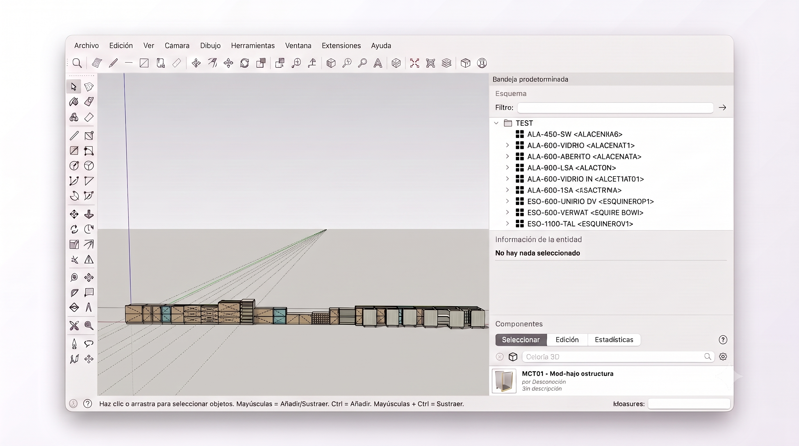

*Figura 1 — Resultado de un lote completo: todos los módulos generados en una sola corrida.*

**Riesgo operativo.** Bajo. La herramienta no modifica los modelos base ni borra trabajo previo; solo escribe archivos nuevos en carpetas de salida. Un módulo que falla queda marcado y no interrumpe a los demás.

---

## 4. Antes de empezar

**Qué se necesita**

| Requisito | Detalle |
|---|---|
| SketchUp | Instalado y funcionando. El instalador está preparado para SketchUp 2023 en adelante. `[por confirmar: versión mínima soportada oficialmente]` |
| SketchUp Pro | Solo para una función: fusionar las dos mitades de cada entrepaño del Esquinero. Sin Pro el mueble se genera igual, con las mitades separadas y un aviso. |
| Excel | Solo si va a usar la vía de captura masiva. Cualquier versión que abra y guarde archivos `.xlsx`. |
| Permisos | Permiso para instalar extensiones en SketchUp. |
| Carpeta del proyecto | Una carpeta accesible desde su equipo que contenga adentro una carpeta llamada **Main Components** con los tres modelos base. Sin ella la herramienta no genera nada. |
| Archivo instalador | El archivo `royal_catalog_creator.rbz`, que le entrega su responsable interno. |

**Qué NO necesita saber**

- Programación de ningún tipo. Nunca abrirá la consola de Ruby de SketchUp.
- Los nombres técnicos de las variables internas de los modelos.
- Cómo se guardan los archivos: la herramienta elige la carpeta de salida por usted.
- Modelado 3D avanzado. La herramienta arma el mueble; usted solo lo acomoda.

> ⚠️ **Atención:** la carpeta del proyecto debe contener la carpeta **Main Components**. Es la única condición que la herramienta verifica antes de dejarla trabajar, y es el origen del error más frecuente en el primer arranque.

---

## 5. Instalación y primer arranque

**Objetivo.** Dejar la herramienta instalada, activada y abierta.

**Prerrequisitos.** SketchUp cerrado o con un archivo abierto, y el archivo `royal_catalog_creator.rbz` guardado en su equipo.

### Paso 1 — Abra el Administrador de extensiones

1. Abra el menú «Extensiones» en la barra superior de SketchUp.
2. Elija «Administrador de extensiones».

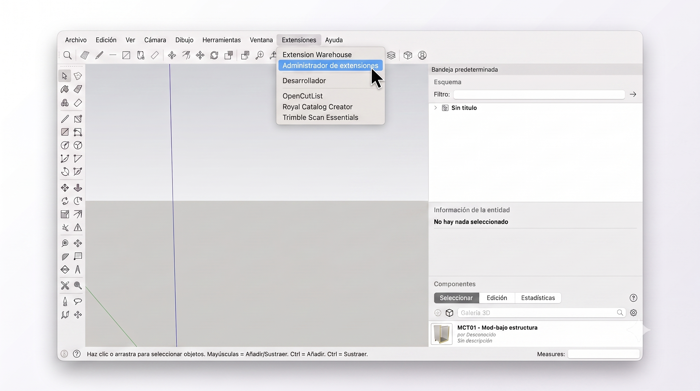

*Figura 2 — Abra el menú «Extensiones» y elija «Administrador de extensiones».*

> 💡 **En la imagen:** el cursor está sobre «Administrador de extensiones», la segunda entrada del menú. Es la que debe elegir.

> ⚠️ Discrepancia detectada: en esta captura el menú ya incluye la entrada «Royal Catalog Creator», porque la fotografía se tomó en un equipo donde la extensión ya estaba instalada. En su primera instalación esa entrada **todavía no aparecerá**. Es normal.

### Paso 2 — Presione «Instalar extensión»

3. En la ventana «Administrador de extensiones», localice el botón «Instalar extensión» al pie de la lista.
4. Presiónelo.

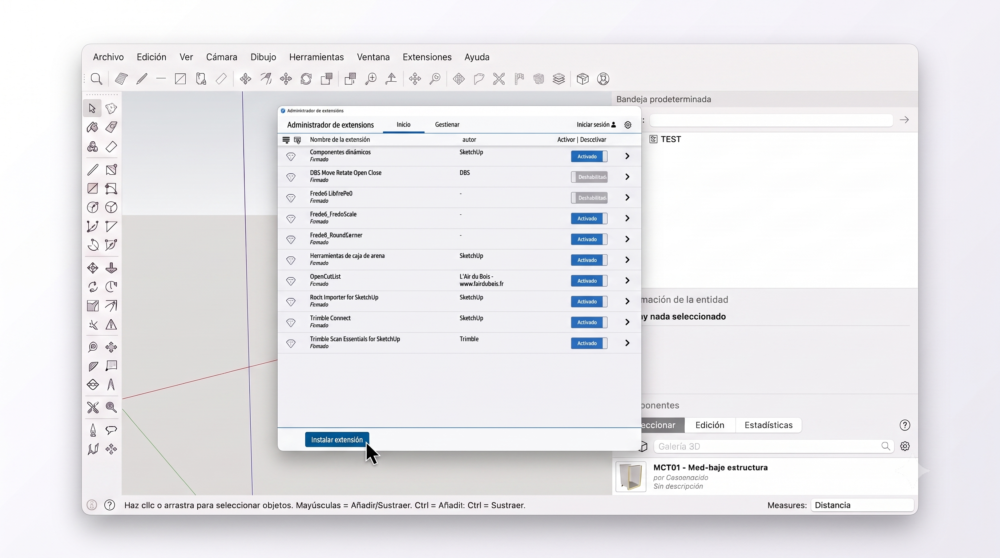

*Figura 3 — En el «Administrador de extensiones», presione «Instalar extensión».*

> 💡 **En la imagen:** el botón azul «Instalar extensión» está en la esquina inferior izquierda de la ventana, debajo de la lista.

### Paso 3 — Elija el archivo instalador

5. En el explorador que se abre, navegue hasta la carpeta donde guardó el instalador.
6. Seleccione el archivo `royal_catalog_creator.rbz`.
7. Confirme con «Abrir».

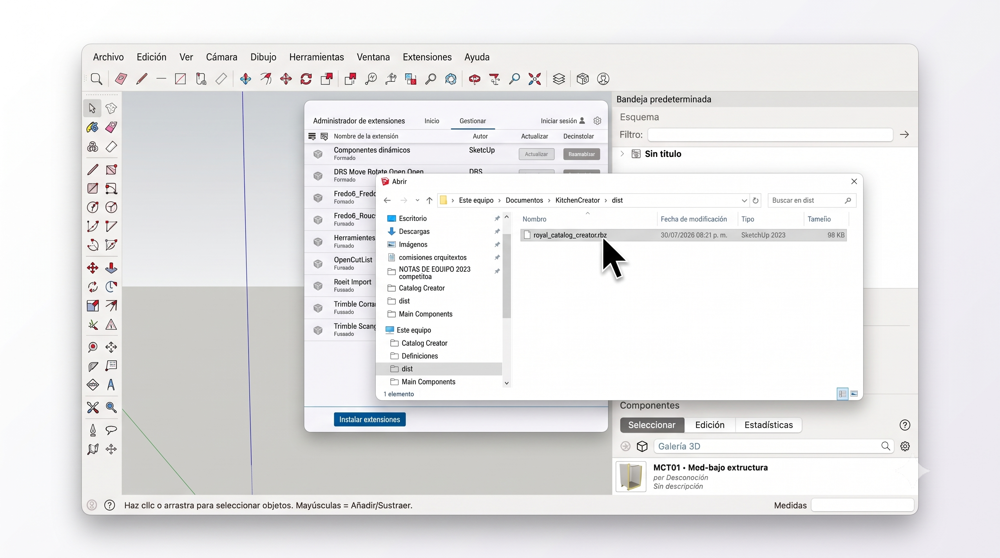

*Figura 4 — Seleccione el archivo `royal_catalog_creator.rbz` dentro de la carpeta `dist`.*

> 💡 **En la imagen:** el archivo es el único de la carpeta y pesa 98 KB. Si ve varios archivos, elija el que termina en `.rbz`.

### Paso 4 — Verifique que quedó activada

8. Revise la lista del administrador y busque «Royal Catalog Creator».
9. Confirme que el autor dice «Royal Kitchens» y el estado dice «Activado».

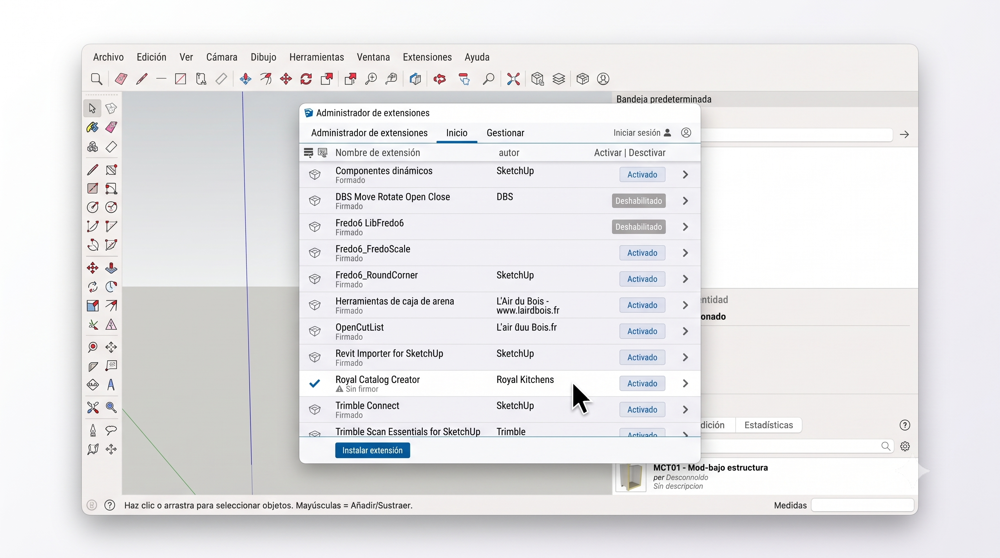

*Figura 5 — La extensión aparece instalada y activada, publicada por Royal Kitchens.*

> 💡 **En la imagen:** junto al nombre aparece la leyenda «Sin firmar». Es esperado: la extensión es interna de Royal Kitchens y no está firmada por Trimble. No indica ningún problema.

### Paso 5 — Abra la herramienta

10. Cierre el Administrador de extensiones.
11. Abra el menú «Extensiones».
12. Elija «Royal Catalog Creator».

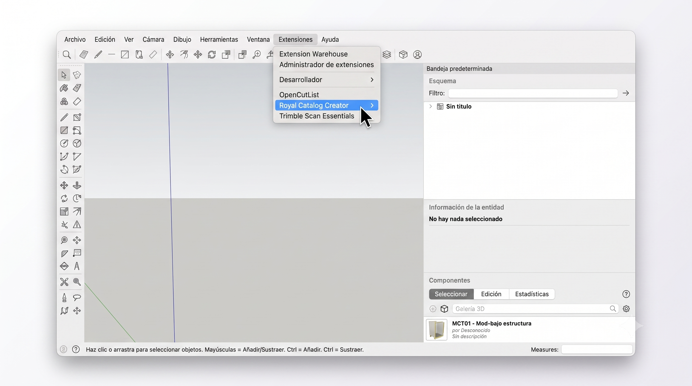

*Figura 6 — Abra la herramienta desde «Extensiones» → «Royal Catalog Creator».*

> 💡 **En la imagen:** la entrada resaltada en azul es la que abre la herramienta. Un solo clic basta.

> ⚠️ Discrepancia detectada: en esta captura la entrada «Royal Catalog Creator» aparece dibujada con una flecha de submenú a la derecha. La extensión se registra como una entrada **simple**, sin submenú: al hacer clic se abre directamente la ventana de la herramienta. Si su equipo muestra la flecha, ignórela y haga clic normalmente.

**Resultado esperado.** Se abre la ventana de Royal Catalog Creator (véase la Figura 7). Además queda disponible una barra de herramientas llamada «Royal Catalog Creator» con un solo botón, que abre la misma ventana.

**Si no aparece la entrada en el menú**

1. Vuelva al Administrador de extensiones y confirme que el estado dice «Activado». Si dice «Deshabilitado», actívelo.
2. Reinicie SketchUp por completo.
3. Si sigue sin aparecer, repita la instalación con el archivo instalador y verifique que descargó el archivo completo.

---

## 6. Conceptos en 2 minutos

| Término | Qué significa |
|---|---|
| **Módulo** | Un mueble concreto que usted está capturando: sus medidas, su puerta, su tirador. Es una tarjeta en la barra lateral. |
| **Familia** | El tipo de mueble: Gabinete, Alacena o Esquinero. Determina qué campos verá en el formulario. |
| **Variación** | Un módulo que nace de otro cambiando uno o dos datos, normalmente con el botón «Clonar». |
| **Plantilla** | Archivo de Excel que la herramienta genera para usted, con una columna por dato y desplegables con las opciones válidas. |
| **Componente base** | El modelo maestro de cada familia que vive en la carpeta **Main Components**. La herramienta lo copia; nunca lo modifica. |
| **Carpeta del proyecto** | La carpeta que contiene **Main Components** y donde se escriben los resultados. Se configura una vez y se recuerda. |
| **Lote** | El conjunto de todos los módulos de la barra lateral, generados uno tras otro con «Generar todos». |
| **Generación** | El acto de convertir un módulo capturado en un archivo de mueble real, con la opción de colocarlo también en el plano abierto. |

---

## 7. Recorrido por la interfaz

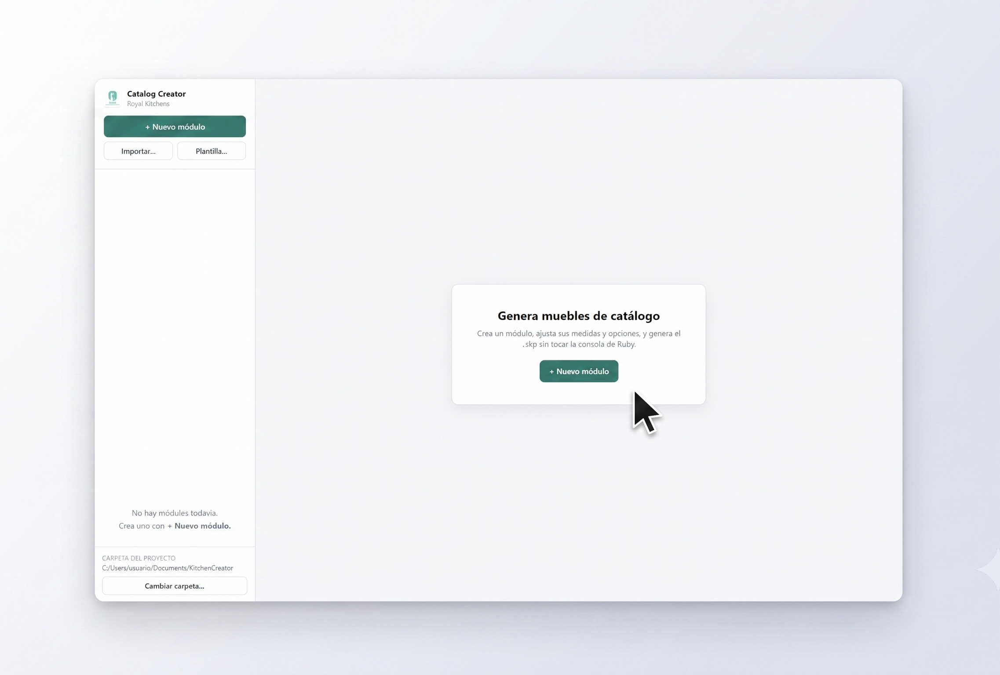

*Figura 7 — Pantalla inicial de la herramienta, sin módulos creados.*

> 💡 **En la imagen:** fíjese al pie de la barra lateral izquierda, en «Carpeta del proyecto». Ahí se lee la ruta que la herramienta está usando. Si no ve una ruta válida, ése es su primer paso.

La ventana se divide en dos zonas: la **barra lateral** izquierda, que es la lista de trabajo, y el **panel central**, que cambia según lo que esté haciendo.

### Barra lateral

| Elemento | Qué hace | Cuándo usarlo |
|---|---|---|
| «Catalog Creator» / «Royal Kitchens» | Encabezado con el logotipo. No es un control. | — |
| «+ Nuevo módulo» | Abre el selector de familia para crear un módulo. | Siempre que quiera agregar un mueble a la lista. |
| «Generar todos (N)» | Genera todos los módulos de la lista, uno por uno. Solo aparece cuando hay al menos un módulo. | Cuando terminó de capturar y quiere producir todo. |
| «Cancelar» | Detiene el lote en curso. Solo aparece mientras hay un lote corriendo. | Si se equivocó y quiere parar. |
| «Importar…» | Abre el explorador para elegir un archivo de Excel o de texto con módulos ya capturados. | Vía masiva. |
| «Plantilla…» | Genera y guarda el archivo de Excel en blanco con todas las columnas y sus desplegables. | Antes de capturar en Excel por primera vez. |
| Tarjeta de módulo | Muestra el nombre, la familia y el estado del módulo. Al hacer clic lo abre en el editor. | Para volver a un módulo y corregirlo. |
| «×» en la tarjeta | Elimina ese módulo de la lista. Su descripción emergente dice «Eliminar módulo». | Para descartar un módulo que no va. |
| «No hay módulos todavía.» / «Crea uno con + Nuevo módulo.» | Aviso que ocupa el lugar de la lista cuando está vacía. | — |
| «Carpeta del proyecto» + ruta | Muestra qué carpeta está usando la herramienta. La ruta se ve en rojo si no es válida. | Para verificar antes de generar. |
| «Cambiar carpeta…» | Abre el selector de carpeta. | La primera vez, o al cambiar de proyecto. |

El estado de cada tarjeta se lee debajo del nombre y es uno de tres: «borrador», «✓ generado» o «✕ error». Si dice «✕ error», deje el puntero encima para leer el motivo.

### Panel central — pantalla de bienvenida

| Elemento | Qué hace | Cuándo usarlo |
|---|---|---|
| «Genera muebles de catálogo» | Título de bienvenida. | — |
| «Crea un módulo, ajusta sus medidas y opciones, y genera el `.skp` sin tocar la consola de Ruby.» | Texto explicativo. | — |
| «+ Nuevo módulo» | Segundo botón, idéntico al de la barra lateral. | Atajo cuando la lista está vacía. |

### Panel central — editor del módulo

| Elemento | Qué hace | Cuándo usarlo |
|---|---|---|
| Etiqueta de familia | Chip verde a la izquierda del nombre. Indica si es Gabinete, Alacena o Esquinero. | — |
| Campo del nombre | Texto editable con la indicación «Nombre del módulo». Es el nombre del archivo que se producirá. | Para cambiar el nombre propuesto automáticamente. |
| «Insertar en escena» | Interruptor. Encendido, además de guardar el archivo coloca el mueble en el plano abierto. | Cuando está armando la cocina en pantalla. |
| «Limpiar piezas ocultas» | Interruptor, encendido de origen. Borra del archivo las variantes de puerta y cajón que quedaron ocultas. | Déjelo encendido salvo indicación contraria. |
| «Clonar» | Duplica el módulo abierto con todos sus datos. | Para producir variaciones rápidas. |
| «Generar» | Produce solo el módulo abierto. | Cuando terminó de capturar un mueble. |
| Encabezados de grupo | «Dimensiones», «Espesores», «Estructura e interior», «Frente y puertas», «Tirador», «Cajones», «Divisores». Se pliegan y despliegan al hacer clic. | Para concentrarse en una sección. |
| «Total en SketchUp: N mm» | Aparece bajo «Alto» y bajo las profundidades. Muestra la medida final una vez sumado el zócalo o el espesor de puerta. | Para confirmar la medida real. |
| Resumen de cajones | Línea que aparece en el grupo «Cajones». Se pone en rojo cuando la configuración no cabe. | Al capturar cajones. |
| «Solo aplica con tipo de medida «Personalizado».» | Nota bajo cada campo de espacio, cuando está apagado. | Le dice por qué el campo está atenuado. |

### Panel central — revisión de la importación

| Elemento | Qué hace | Cuándo usarlo |
|---|---|---|
| «Importar» + resumen | El resumen dice, por ejemplo, «20 filas · 20 listas · 0 con error». | Para saber si puede continuar. |
| «Descartar filas con error» | Quita de la tabla las filas marcadas con error. Se desactiva si no hay ninguna. | Cuando prefiere importar solo lo bueno. |
| «Cancelar» | Abandona la importación sin crear nada. | Si el archivo está muy mal. |
| «Importar N» | Confirma y crea los módulos. El número es cuántas filas están listas. | Cuando el resumen le convence. |
| Columna de estado | Una marca por fila: palomita si está lista, triángulo si tiene avisos, tache si tiene error. | Para localizar qué corregir. |
| Celdas atenuadas | Columnas que no aplican a la familia de esa fila. Su descripción emergente dice «No aplica a esta familia.» | Para entender por qué una celda está gris. |

### Ventanas emergentes y avisos

| Elemento | Qué hace |
|---|---|
| «Nuevo módulo» | Ventana con el texto «Elige el tipo de módulo a crear.» y las tres tarjetas de familia. Se cierra con «×» o con la tecla Escape. |
| «Generar todos» | Ventana de confirmación antes de un lote, con los botones «Cancelar» y «Continuar». |
| Avisos emergentes | Mensajes que aparecen en la esquina y desaparecen solos a los pocos segundos. Todos están listados en la [sección 13](#13-solución-de-problemas). |

---

## 8. Tareas paso a paso

### 8a. Configurar o cambiar la carpeta del proyecto

**Objetivo.** Indicarle a la herramienta dónde están los modelos base y dónde debe escribir los resultados.

**Prerrequisitos.** Conocer la ruta de la carpeta del proyecto de Royal Kitchens en su equipo o en la red.

1. Mire al pie de la barra lateral, bajo «Carpeta del proyecto».
2. Si la ruta que aparece no es la correcta o se ve en rojo, presione «Cambiar carpeta…».
3. En el selector, navegue hasta la carpeta del proyecto.
4. Seleccione la carpeta que contiene adentro la carpeta **Main Components** — no entre a **Main Components**, quédese un nivel arriba.
5. Confirme.

**Resultado esperado.** La ruta se actualiza al pie de la barra lateral y deja de verse en rojo. La herramienta recuerda esta elección para las siguientes sesiones.

> ⚠️ **Atención:** si elige una carpeta que no contiene **Main Components**, aparece el mensaje «La carpeta seleccionada no contiene «Main Components».» seguido de la ruta, y la configuración no cambia.

### 8b. Crear un módulo nuevo y elegir su familia

**Objetivo.** Agregar un mueble a la lista de trabajo.

**Prerrequisitos.** La herramienta abierta.

1. Presione «+ Nuevo módulo».
2. Lea el texto «Elige el tipo de módulo a crear.».
3. Haga clic en la tarjeta de la familia que necesita: «Gabinete», «Alacena» o «Esquinero».

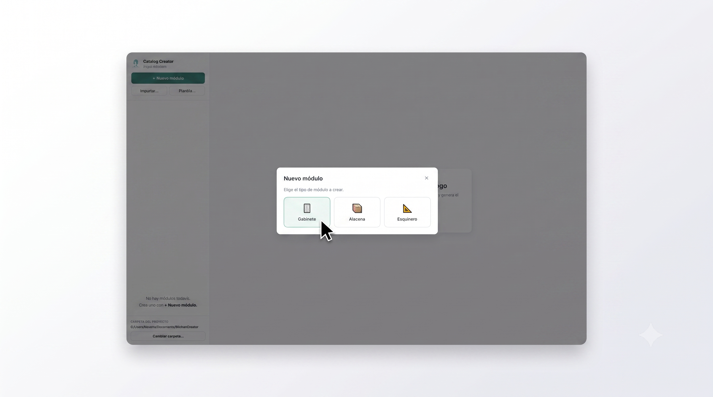

*Figura 8 — Elija la familia del módulo: Gabinete, Alacena o Esquinero.*

> 💡 **En la imagen:** las tres tarjetas están en fila. La primera, resaltada bajo el cursor, es «Gabinete». A la derecha están «Alacena» y «Esquinero».

**Resultado esperado.** La ventana se cierra, aparece una tarjeta nueva en la barra lateral con un nombre propuesto automáticamente, y el formulario de esa familia se abre en el panel central.

> 💡 **Tip:** si abrió la ventana por error, ciérrela con «×» o con la tecla Escape.

### 8c. Llenar el formulario del módulo

**Objetivo.** Capturar las medidas y opciones del mueble.

**Prerrequisitos.** Un módulo creado y abierto en el editor.

1. Escriba el nombre del módulo en el campo de arriba, junto a la etiqueta de familia.
2. Abra el grupo «Dimensiones» y capture el ancho, la profundidad y el alto en milímetros.
3. Revise la línea «Total en SketchUp: N mm» bajo el alto: ahí ve la medida final con el zócalo ya sumado.
4. Abra el grupo «Espesores» y ajuste los espesores si el proyecto lo pide.
5. Abra «Estructura e interior» y elija el tipo de techo, el ancho de amarres, si lleva entrepaño y, en Gabinete, si lleva ceja.
6. Abra «Frente y puertas» y elija el diseño de puerta en el desplegable.
7. Capture los cuatro márgenes del frente en el recuadro «Márgenes del frente», cada uno en su posición alrededor del rectángulo «Frente».
8. Abra «Tirador» y elija tipo, posición y orientación.
9. Si eligió un diseño de puerta con cajones, abra «Cajones» y capture cantidad y alturas.
10. Abra «Divisores» y capture cuántas divisiones lleva el interior.

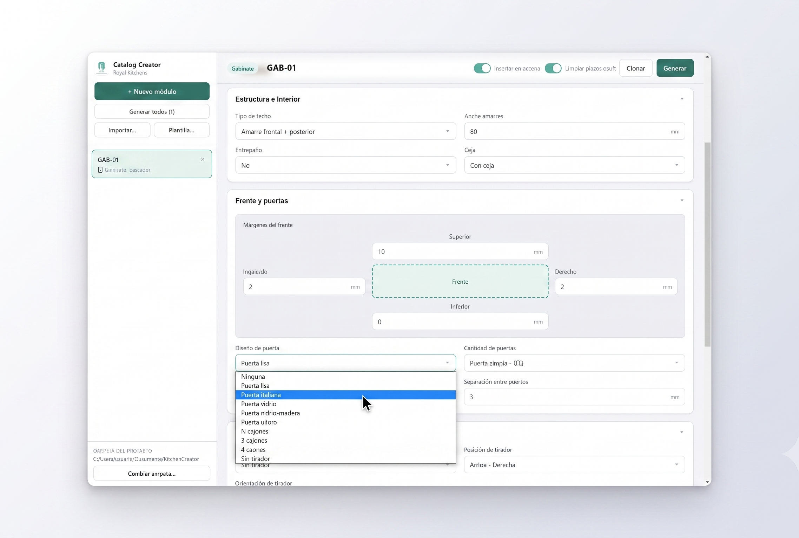

*Figura 9 — Formulario del módulo con el desplegable «Diseño de puerta» abierto.*

> 💡 **En la imagen:** el desplegable «Diseño de puerta» está abierto y muestra las opciones disponibles para un Gabinete, desde «Ninguna» hasta las variantes con cajones. Arriba a la derecha están los dos interruptores y los botones «Clonar» y «Generar».

**Resultado esperado.** Todos los campos obligatorios llenos, sin ninguna línea en rojo en el grupo «Cajones». La tarjeta del módulo muestra el estado «borrador».

> 💡 **Tip:** los campos atenuados no están rotos. Debajo de cada uno hay una nota que explica con qué configuración se activan; por ejemplo, «Solo aplica con tipo de medida «Personalizado».».

### 8d. Usar «Clonar» para variar un módulo

**Objetivo.** Producir una variación sin volver a capturar todo.

**Prerrequisitos.** Un módulo ya capturado y abierto.

1. Abra en el editor el módulo que quiere usar como base.
2. Presione «Clonar».
3. Cambie el nombre propuesto, que llega con el sufijo `-copia`.
4. Modifique el o los datos que hacen distinta la variación.

**Resultado esperado.** Aparece el aviso «Módulo clonado» con el nombre de la copia, y la nueva tarjeta queda seleccionada en la barra lateral con todos los datos del original.

> 💡 **Tip:** clonar es la forma más rápida de armar una corrida de anchos: capture el primero completo y clone tantas veces como anchos necesite, cambiando solo el campo «Ancho» y el nombre.

### 8e. Generar un módulo individual

**Objetivo.** Producir el archivo de un solo mueble.

**Prerrequisitos.** Carpeta del proyecto configurada y el módulo abierto sin errores.

1. Decida si quiere el mueble también en el plano abierto y ajuste el interruptor «Insertar en escena».
2. Decida si quiere el archivo depurado y ajuste el interruptor «Limpiar piezas ocultas».
3. Presione «Generar».
4. Espere a que aparezca el aviso de resultado.

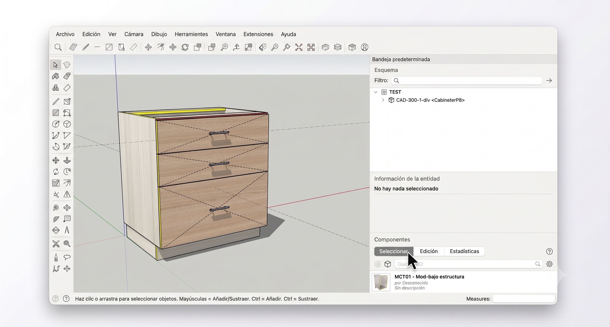

*Figura 10 — Resultado de generar un módulo individual, insertado en la escena.*

> 💡 **En la imagen:** el mueble ya está armado en el plano y el panel «Esquema» de la derecha lista el componente resultante con su nombre. Ése es el nombre que usted escribió en el editor.

**Qué hacen los dos interruptores**

| Interruptor | Encendido | Apagado |
|---|---|---|
| «Insertar en escena» | Guarda el archivo **y además** coloca el mueble en el plano abierto, pegado a la derecha del anterior. | Solo guarda el archivo. El plano no cambia. |
| «Limpiar piezas ocultas» | Borra del archivo las variantes de puerta y cajón que el modelo dejó ocultas. El archivo queda más ligero, pero deja de ser reconfigurable. | Conserva todas las variantes. El archivo pesa más y sigue siendo reconfigurable. |

**Resultado esperado.** Aparece el aviso «Módulo generado» con la ruta del archivo, y la tarjeta pasa a «✓ generado». Si eligió insertar en escena, el mueble aparece en el plano.

> ⚠️ **Atención:** los dos interruptores son de sesión, no del módulo. Su posición aplica a todo lo que genere después, incluido un lote completo.

### 8f. Acumular varios módulos y generarlos en lote

**Objetivo.** Producir de una sola vez todos los módulos de la lista.

**Prerrequisitos.** Al menos un módulo en la barra lateral y la carpeta del proyecto configurada.

1. Capture o importe todos los módulos que necesite.
2. Revise que ninguna tarjeta muestre «✕ error».
3. Ajuste los dos interruptores del editor, porque aplican a todo el lote.
4. Presione «Generar todos (N)».
5. Lea la ventana de confirmación: le dice cuántos módulos se van a generar y le advierte que los ya generados se sobrescriben.
6. Presione «Continuar».
7. Espere. El propio botón se convierte en el indicador de avance y muestra «Generando N/M…».

Para detener un lote en curso:

8. Presione «Cancelar», que aparece junto al botón de avance.
9. Espere: el botón cambia a «Cancelando…» y el lote se detiene **después** de terminar el módulo en curso, no a media construcción.

*Figura 11 — Un lote completo terminado: todos los módulos generados y alineados en la escena.*

> 💡 **En la imagen:** los muebles quedan colocados uno junto a otro formando una corrida. El panel «Esquema» de la derecha lista cada componente por su nombre de salida.

**Resultado esperado.** Aparece el aviso «Lote terminado» con el resumen, por ejemplo «20 generados» o «18 generados · 2 con error». Cada tarjeta queda marcada según su resultado.

> ⚠️ **Atención:** un módulo que falla no detiene el lote. Queda marcado con «✕ error» y el resto continúa.

### 8g. Descargar la plantilla de Excel

**Objetivo.** Obtener el archivo de captura con todas las columnas y sus desplegables.

**Prerrequisitos.** Carpeta del proyecto configurada.

1. Presione «Plantilla…» en la barra lateral.
2. En la ventana «Guardar plantilla de importación», elija dónde guardarla. La herramienta propone la carpeta **Input** del proyecto.
3. Acepte o cambie el nombre propuesto `plantilla_catalogo.xlsx`.
4. Confirme.

**Resultado esperado.** Aparece el aviso «Plantilla generada» con la ruta del archivo. El archivo tiene tres hojas: `Modulos` para capturar, `Listas` que alimenta los desplegables, e `Instrucciones` con el resumen de llenado.

> ⚠️ **Atención:** no edite ni reordene la hoja `Listas`. Es la que hace funcionar los desplegables.

### 8h. Llenar la plantilla en Excel

**Objetivo.** Capturar varios módulos fuera de SketchUp.

**Prerrequisitos.** La plantilla descargada.

1. Abra el archivo y sitúese en la hoja `Modulos`.
2. Lea la hoja `Instrucciones` una vez.
3. Borre o sobrescriba las tres filas de ejemplo, una por familia, que vienen debajo de los encabezados.
4. En cada fila, elija la familia en la columna `familia` usando su desplegable.
5. Escriba el nombre del archivo en la columna `nombre_salida`.
6. Llene solo las columnas que aplican a esa familia: las que no llevan prefijo valen para las tres, y las que empiezan con `[GAB]`, `[ALA]`, `[ESQ]`, `[GAB·ALA]` o `[GAB·ESQ]` solo valen para las familias indicadas.
7. Escriba las medidas como números simples, sin la unidad: la unidad ya viene en el encabezado.
8. En las columnas con desplegable, elija la opción de la lista tal como está escrita.
9. Deje vacía cualquier celda cuyo valor por omisión le sirva.
10. Guarde el archivo en formato `.xlsx`.

**Resultado esperado.** Un archivo con una fila por módulo, listo para importar.

> 💡 **Tip:** en las columnas de márgenes de divisor y de alturas de cajón puede escribir una medida libre además de las opciones de la lista. Escribir `250` equivale a elegir «Personalizado…» y capturar 250 mm.

### 8i. Importar el archivo

**Objetivo.** Cargar en la herramienta todos los módulos capturados en Excel.

**Prerrequisitos.** Carpeta del proyecto configurada y el archivo guardado.

#### Paso 1 — Seleccione el archivo

1. Presione «Importar…».
2. En la ventana «Elegir archivo a importar», navegue hasta donde guardó su captura. La herramienta propone la carpeta **Input** del proyecto.
3. Seleccione el archivo.
4. Confirme con «Abrir».

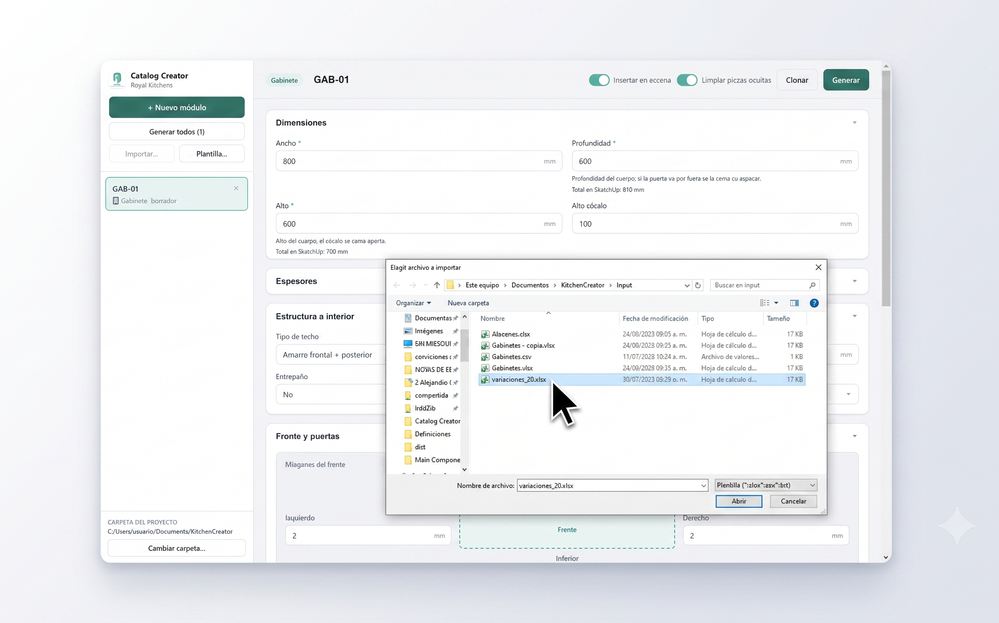

*Figura 12 — Seleccione el archivo de captura desde la carpeta `Input`.*

> 💡 **En la imagen:** el archivo seleccionado en la lista es el de captura. Detrás se alcanza a ver el grupo «Dimensiones» del módulo que ya estaba abierto, con su ancho, profundidad, alto y alto de zócalo.

#### Paso 2 — Revise la tabla de validación

5. Lea el resumen del encabezado: dice cuántas filas trae el archivo, cuántas están listas y cuántas tienen error.
6. Recorra la columna de estado a la izquierda: palomita significa lista, triángulo significa que hay avisos, tache significa error.
7. Si hay errores, deje el puntero sobre la celda marcada en rojo para leer el motivo.
8. Corrija directamente en la tabla lo que sea puntual, escribiendo o eligiendo en la celda.
9. Si prefiere no cargar las filas malas, presione «Descartar filas con error».
10. Si el archivo tiene muchos errores, presione «Cancelar», corríjalo en Excel y vuelva a cargarlo.

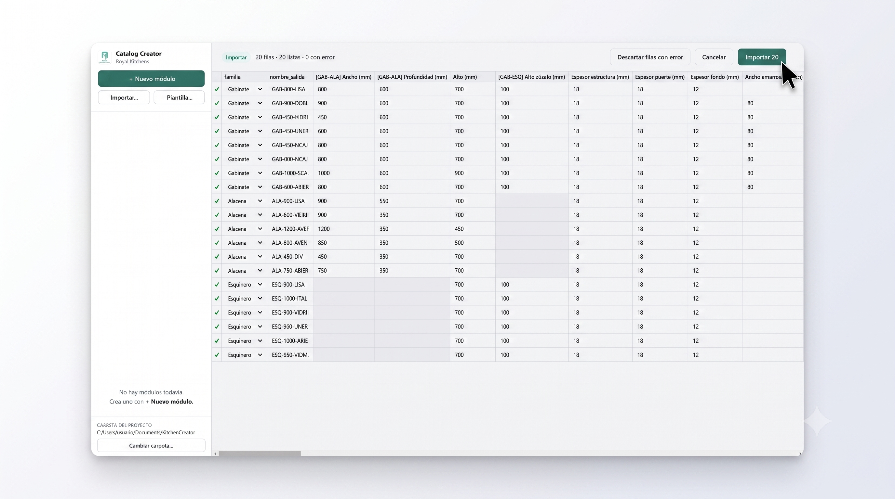

*Figura 13 — Revise la tabla de validación antes de confirmar: el resumen indica cuántas filas están listas y cuántas tienen error.*

> 💡 **En la imagen:** el resumen del encabezado dice «20 filas · 20 listas · 0 con error». Note las celdas atenuadas: son columnas que no aplican a la familia de esa fila, como el alto de zócalo en las filas de Alacena.

#### Paso 3 — Confirme

11. Presione «Importar N», donde N es el número de filas listas.

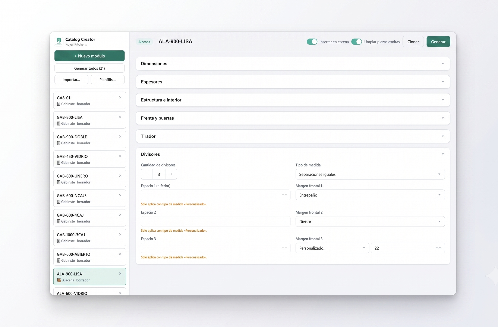

*Figura 14 — Tras confirmar, los módulos quedan cargados en la barra lateral y listos para generarse.*

> 💡 **En la imagen:** el botón de la barra lateral dice «Generar todos (21)» aunque el archivo traía 20 filas. La vigesimoprimera es un módulo que ya estaba en la sesión antes de importar.

**Resultado esperado.** Aparece el aviso «Importados N módulos» con el texto «Quedan como borradores: revísalos y usa «Generar todos».». Las tarjetas nuevas aparecen en la barra lateral con estado «borrador».

> ⚠️ **Atención:** importar **agrega** módulos a la sesión, no la reemplaza. Lo que ya estaba en la barra lateral sigue ahí y se suma al conteo del botón «Generar todos». Si no quiere que se mezclen, elimine los módulos previos con la «×» de cada tarjeta antes de importar.

### 8j. Localizar y revisar los archivos generados

**Objetivo.** Encontrar los muebles producidos.

**Prerrequisitos.** Al menos un módulo generado.

1. Abra la carpeta del proyecto que aparece al pie de la barra lateral.
2. Entre a la carpeta **Output**.
3. Entre a la subcarpeta de la familia: **Gabinetes**, **Alacenas** o **Esquineros**.
4. Localice el archivo con el nombre que usted capturó.

**Resultado esperado.** Un archivo `.skp` por módulo generado, con exactamente el nombre de salida que usted escribió.

> 💡 **Tip:** puede agregar esa carpeta como colección local en el panel de Componentes de SketchUp y arrastrar los muebles desde ahí a cualquier plano.

### 8k. Corregir un módulo y volver a generarlo

**Objetivo.** Arreglar un módulo que salió mal o cambió de especificación.

**Prerrequisitos.** El módulo todavía en la barra lateral.

1. Haga clic en la tarjeta del módulo.
2. Si la tarjeta decía «✕ error», deje el puntero sobre el estado para leer el motivo antes de tocar nada.
3. Corrija los campos que hagan falta.
4. Observe que el estado vuelve a «borrador» en cuanto modifica algo.
5. Presione «Generar».

**Resultado esperado.** Se produce un archivo nuevo con el mismo nombre, que sobrescribe al anterior, y la tarjeta vuelve a «✓ generado».

> ⚠️ **Atención:** si el módulo ya no está en la barra lateral —porque cerró la ventana o eliminó la tarjeta— hay que volver a capturarlo. La herramienta no lee de vuelta un archivo ya generado.

---

## 9. Ejemplo guiado completo

El archivo de ejemplo `variaciones_20.xlsx`, guardado en la carpeta **Input** del proyecto, es un caso real de captura masiva. Trae **20 filas de datos**: 8 Gabinetes, 6 Alacenas y 6 Esquineros, repartidas en 62 columnas.

**Cómo está llena la captura**

Todas las filas comparten un mismo esqueleto: espesor de estructura 18 mm, espesor de puerta 18 mm, espesor de fondo 12 mm, márgenes del frente de 0 mm arriba y abajo y 2 mm a los lados, y separación entre puertas de 3 mm. Sobre esa base, cada fila varía lo que la hace distinta.

| Bloque | Filas | Qué varía entre ellas |
|---|---|---|
| Gabinetes | `GAB-800-LISA`, `GAB-900-DOBLE`, `GAB-450-VIDRIO`, `GAB-600-UNERO`, `GAB-800-NCAJ3`, `GAB-800-4CAJ`, `GAB-1000-3CAJ`, `GAB-600-ABIERTO` | Anchos de 450 a 1000 mm; diseños de puerta lisa, italiana, vidrio y uñero; tres variantes con cajones; y una sin puerta con seis divisiones a medida. Todos con 600 mm de profundidad y 100 mm de zócalo. |
| Alacenas | `ALA-900-LISA`, `ALA-600-VIDRIO`, `ALA-1200-AVENTOS`, `ALA-800-AVENTOD`, `ALA-450-DIV`, `ALA-750-ABIERTA` | Anchos de 450 a 1200 mm, todas de 350 mm de profundidad; puertas lisas, de vidrio y abatibles de las series Avento; una con dos divisiones a medida y una sin puerta. |
| Esquineros | `ESQ-900-LISA`, `ESQ-1000-ITAL`, `ESQ-800-VIDRIO`, `ESQ-900-UNERO-DIV`, `ESQ-1100-ABIERTO`, `ESQ-950-VIDMAD` | Cada uno declara su ancho izquierdo, su ancho derecho y las dos profundidades por separado; márgenes de planta de 20 mm al frente y 10 mm a los lados. |

Fíjese en las columnas que **no** se llenan en cada bloque: las filas de Alacena dejan vacía la columna de alto de zócalo, porque una alacena no lo lleva; las de Esquinero dejan vacías las columnas de ancho y profundidad con prefijo `[GAB·ALA]`, porque el esquinero usa sus propias columnas con prefijo `[ESQ]`. Esas celdas son las que se ven atenuadas en la tabla de validación.

**Cómo se procesa**

El recorrido es exactamente el de la [sección 8i](#8i-importar-el-archivo). Se elige el archivo en la carpeta **Input** (Figura 12); la herramienta lo lee y presenta la tabla de revisión con el resumen «20 filas · 20 listas · 0 con error» (Figura 13); al confirmar con «Importar 20», las veinte tarjetas aparecen en la barra lateral (Figura 14). En esa última imagen el contador dice 21 porque el módulo «GAB-01», capturado a mano antes de importar, sigue en la sesión.

**Qué archivos resultan**

Al presionar «Generar todos (20)» y confirmar, la herramienta produce veinte archivos repartidos en tres carpetas:

| Carpeta | Archivos |
|---|---|
| `Output/Gabinetes` | Los 8 archivos que empiezan con `GAB-`. |
| `Output/Alacenas` | Los 6 archivos que empiezan con `ALA-`. |
| `Output/Esquineros` | Los 6 archivos que empiezan con `ESQ-`. |

Con el interruptor «Insertar en escena» encendido, además quedan colocados en el plano, uno junto a otro (Figura 11). El aviso final dice «Lote terminado» seguido de «20 generados».

---

## 10. Guía de captura — referencia de campos

Las medidas van siempre en milímetros, salvo la corredera de cajón, que va en centímetros. Un campo obligatorio impide generar si queda vacío; un campo opcional vacío usa el valor por omisión que se indica en la columna de ejemplo.

### Gabinete

| Campo | Qué significa en la cocina real | Valores válidos | Unidad | Obligatorio | Ejemplo |
|---|---|---|---|---|---|
| Ancho | Ancho del cuerpo del mueble. | Cualquier medida | mm | Sí | 800 |
| Profundidad | Fondo del cuerpo. Si la puerta va por fuera, su espesor se suma aparte. | Cualquier medida | mm | Sí | 600 |
| Alto | Alto del cuerpo. El zócalo se suma aparte. | Cualquier medida | mm | Sí | 700 |
| Alto zócalo | Altura de la base sobre la que se apoya el mueble. | Cualquier medida | mm | No | 100 |
| Espesor estructura | Grueso del tablero del cuerpo. | Cualquier medida | mm | No | 18 |
| Espesor puerta | Grueso del tablero de la puerta. | Cualquier medida | mm | No | 18 |
| Espesor fondo | Grueso del tablero trasero. | Cualquier medida | mm | No | 12 |
| Espesor estructura cajones | Grueso del tablero de la caja del cajón. | Cualquier medida | mm | No | 15 |
| Espesor puerta cajones | Grueso del frente del cajón. | Cualquier medida | mm | No | 18 |
| Espesor fondo cajones | Grueso del fondo del cajón. | Cualquier medida | mm | No | 10 |
| Tipo de techo | Cómo se cierra el mueble por arriba. | Ninguno · Amarre frontal · Amarre posterior · Amarre frontal + posterior · Techo completo | — | No | Amarre frontal + posterior |
| Ancho amarres | Ancho de los travesaños de amarre. | Cualquier medida | mm | No | 80 |
| Entrepaño | Si el interior lleva repisa. | Sí · No | — | No | No |
| Ceja | Si el frente lleva ceja perimetral. | Con ceja · Sin ceja | — | No | Con ceja |
| Diseño de puerta | Tipo de frente del mueble. | Ninguna · Puerta lisa · Puerta italiana · Puerta vidrio · Puerta vidrio-madera · Puerta uñero · N cajones · 2 cajones · 3 cajones · 4 cajones | — | No | Puerta lisa |
| Cantidad de puertas | Cuántas hojas y hacia qué lado abren. | Puerta simple - IZQ · Puerta simple - DER · Puerta doble · Puerta - 3 … Puerta - 10 | — | No | Puerta doble |
| Posición de puertas | Si la puerta monta por fuera o por dentro del cuerpo. | Puerta/Cajón exterior · Puerta/Cajón interior | — | No | Puerta/Cajón exterior |
| Separación entre puertas | Junta entre hoja y hoja. | Cualquier medida | mm | No | 3 |
| Margen superior / inferior / izquierdo / derecho | Holgura del frente contra el cuerpo por cada lado. | Cualquier medida | mm | No | 0 / 0 / 2 / 2 |
| Tipo de tirador | Herraje del frente. | Sin tirador · Tirador secc. circular · Tirador secc. cuadrada · Tirador arco · Tirador botón cuadrado · Tirador botón circular · Tirador CLE | — | No | Tirador arco |
| Posición de tirador | Dónde va el tirador sobre el frente. | Nueve combinaciones de Arriba/Centro/Abajo con Izquierda/Centro/Derecha | — | No | Arriba - Derecha |
| Orientación de tirador | Cómo se monta el tirador. | Tirador horizontal · Tirador vertical | — | No | Tirador vertical |
| Estilo cajones | Sistema de corredera del cajón. | Tandem · Antaro | — | No | Tandem |
| Cantidad de cajones | Cuántos cajones lleva. Solo se activa con el diseño «N cajones». | 1 a 6 | — | No | 3 |
| Alto cajón 1 (superior) … Alto cajón 4 (inferior) | Alto del frente de cada cajón, contando desde arriba. | Automático (restante) · CH (190 mm) · G (383 mm) · Personalizado… | mm | No | CH (190 mm) |
| Separación entre cajones | Junta entre frente y frente de cajón. | Cualquier medida | mm | No | 3 |
| Corredera cajón | Longitud de la corredera. | Cualquier medida | cm | No | 50 |
| Cantidad de divisores | Cuántas divisiones horizontales lleva el interior. | 1 a 6 | — | No | 2 |
| Tipo de medida | Cómo se reparte la altura entre las divisiones. | Separaciones iguales · Personalizado | — | No | Separaciones iguales |
| Espacio 1 (inferior) … Espacio 7 | Altura de cada división, contando desde abajo. Solo se activan con tipo de medida «Personalizado». | Cualquier medida | mm | No | 140 |
| Margen frontal 1 … Margen frontal 6 | Si esa división es un entrepaño o un divisor, y con qué retranqueo. | Entrepaño · Divisor · Personalizado… | mm | No | Entrepaño |

### Alacena

La Alacena no lleva zócalo, ni ceja, ni tipo de techo, ni cajones. Comparte con el Gabinete todos los campos de espesores, márgenes del frente, tirador y divisores, con los mismos valores válidos.

| Campo | Qué significa en la cocina real | Valores válidos | Unidad | Obligatorio | Ejemplo |
|---|---|---|---|---|---|
| Ancho | Ancho del cuerpo. | Cualquier medida | mm | Sí | 900 |
| Profundidad | Fondo del cuerpo. Si la puerta va por fuera, su espesor se suma aparte. | Cualquier medida | mm | Sí | 350 |
| Alto | Alto del cuerpo. | Cualquier medida | mm | Sí | 700 |
| Espesor estructura / puerta / fondo | Grueso de cada tablero. | Cualquier medida | mm | No | 18 / 18 / 12 |
| Ancho amarres | Ancho de los travesaños de amarre. | Cualquier medida | mm | No | 80 |
| Entrepaño | Si el interior lleva repisa. | Sí · No | — | No | No |
| Diseño de puerta | Tipo de frente, incluidas las variantes abatibles Avento. | Ninguna · Puerta lisa · Puerta italiana · Puerta vidrio · Puerta vidrio-madera · Puerta uñero · Avento S lisa · Avento S italiana · Avento S vidrio · Avento S vidrio-madera · Avento D lisa · Avento D italiana · Avento D vidrio · Avento D vidrio-madera | — | No | Puerta lisa |
| Cantidad de puertas | Cuántas hojas lleva el frente. | Puerta - 1 … Puerta - 10 | — | No | Puerta - 2 |
| Tipo de puerta abatible | Cómo se comportan las hojas de una abatible. | Puerta simple · Puerta doble - individual · Puerta doble - unidas | — | No | Puerta doble - unidas |
| Posición de puertas | Si la puerta monta por fuera o por dentro. | Puerta/Cajón exterior · Puerta/Cajón interior | — | No | Puerta/Cajón exterior |
| Separación entre puertas | Junta entre hoja y hoja. | Cualquier medida | mm | No | 3 |
| Margen superior / inferior / izquierdo / derecho | Holgura del frente por cada lado. | Cualquier medida | mm | No | 0 / 0 / 2 / 2 |
| Tipo / Posición / Orientación de tirador | Herraje del frente. | Mismos valores que en Gabinete | — | No | Tirador arco |
| Cantidad de divisores | Cuántas divisiones lleva el interior. | 1 a 6 | — | No | 2 |
| Tipo de medida | Cómo se reparte la altura. | Separaciones iguales · Personalizado | — | No | Personalizado |
| Espacio 1 (inferior) … Espacio 7 | Altura de cada división. Solo con tipo de medida «Personalizado». | Cualquier medida | mm | No | 330 |
| Margen frontal 1 … Margen frontal 6 | Si esa división es entrepaño o divisor. | Entrepaño · Divisor · Personalizado… | mm | No | Divisor |

### Esquinero

El Esquinero tiene dos alas, así que declara un ancho y una profundidad por cada una. No lleva cantidad de puertas, ni ceja, ni cajones, y sus márgenes de divisor se capturan en planta, no por división.

| Campo | Qué significa en la cocina real | Valores válidos | Unidad | Obligatorio | Ejemplo |
|---|---|---|---|---|---|
| Ancho izquierdo | Longitud del ala izquierda contra la pared. | Cualquier medida | mm | Sí | 900 |
| Ancho derecho | Longitud del ala derecha contra la pared. | Cualquier medida | mm | Sí | 900 |
| Alto | Alto del cuerpo. El zócalo se suma aparte. | Cualquier medida | mm | Sí | 700 |
| Profundidad izquierda | Fondo del ala izquierda. Si la puerta va por fuera, su espesor se suma aparte. | Cualquier medida | mm | Sí | 600 |
| Profundidad derecha | Fondo del ala derecha. Mismo criterio. | Cualquier medida | mm | Sí | 600 |
| Alto zócalo | Altura de la base. | Cualquier medida | mm | No | 100 |
| Espesor estructura / puerta / fondo | Grueso de cada tablero. | Cualquier medida | mm | No | 18 / 18 / 12 |
| Ancho amarres | Ancho de los travesaños de amarre. | Cualquier medida | mm | No | 80 |
| Entrepaño | Si el interior lleva repisa en L. | Sí · No | — | No | No |
| Diseño de puerta | Tipo de frente. La lista es más corta que la del Gabinete: el esquinero no arma cajones. | Ninguna · Puerta lisa · Puerta italiana · Puerta vidrio · Puerta vidrio-madera · Puerta uñero | — | No | Puerta lisa |
| Posición de puertas | Si la puerta monta por fuera o por dentro. | Puerta/Cajón exterior · Puerta/Cajón interior | — | No | Puerta/Cajón exterior |
| Separación entre puertas | Junta entre hoja y hoja. | Cualquier medida | mm | No | 3 |
| Margen superior / inferior / izquierdo / derecho | Holgura del frente por cada lado. | Cualquier medida | mm | No | 0 / 0 / 2 / 2 |
| Tipo / Posición / Orientación de tirador | Herraje del frente. | Mismos valores que en Gabinete | — | No | Tirador secc. circular |
| Cantidad de divisores | Cuántas repisas lleva el interior. | 1 a 6 | — | No | 2 |
| Tipo de medida | Cómo se reparte la altura. | Separaciones iguales · Personalizado | — | No | Personalizado |
| Margen frontal / posterior / izquierdo / derecho | Retranqueo de la repisa vista en planta, por cada lado. | Cualquier medida | mm | No | 20 / 0 / 10 / 10 |
| Espacio 1 (inferior) … Espacio 7 | Altura de cada división. Solo con tipo de medida «Personalizado». | Cualquier medida | mm | No | 300 |

---

## 11. Reglas de captura que evitan errores

**1. Los prefijos del encabezado dicen a qué familias aplica cada columna.**
*Por qué existe:* dos familias comparten columna solo cuando el dato significa exactamente lo mismo. «Profundidad» y «Ancho derecho» son el mismo dato interno con significados distintos, así que van en columnas separadas.
*Qué pasa si se rompe:* si llena una columna que no aplica a la familia de esa fila, el dato **se ignora** y la fila muestra el aviso ««nombre de la columna» no aplica a Familia: se ignora.». La fila se importa igual, pero el mueble no sale como usted esperaba.
*Cómo leerlos:* sin prefijo vale para las tres familias; `[GAB·ALA]` vale para Gabinete y Alacena; `[GAB·ESQ]` para Gabinete y Esquinero; `[GAB]`, `[ALA]` o `[ESQ]` para una sola.

> ⚠️ Discrepancia detectada: la captura de la tabla de validación (Figura 13) muestra los prefijos escritos con guion, como `[GAB-ALA]`. El separador real que produce la herramienta es un punto medio: `[GAB·ALA]` y `[GAB·ESQ]`. Copie siempre el encabezado tal como venga en su propia plantilla.

**2. Todas las medidas van en milímetros, sin escribir la unidad.**
*Por qué existe:* la unidad ya viene declarada en el encabezado de la columna y en la etiqueta del formulario. La única excepción es la corredera de cajón, que va en centímetros.
*Qué pasa si se rompe:* escribir texto que no sea una medida marca la celda con «No es una medida válida.» y la fila no se puede importar.

**3. Los campos «Espacio N» solo funcionan con tipo de medida «Personalizado».**
*Por qué existe:* con «Separaciones iguales» el reparto lo calcula el modelo; capturar alturas ahí sería prometer un control que no existe.
*Qué pasa si se rompe:* en el formulario los campos aparecen atenuados con la nota «Solo aplica con tipo de medida «Personalizado».». Al importar, el dato se descarta con el aviso ««Espacio 1 (inferior)» no aplica con esta configuración: se ignora.».

**4. «Cantidad de cajones» solo se activa con el diseño de puerta «N cajones».**
*Por qué existe:* los diseños «2 cajones», «3 cajones» y «4 cajones» ya traen la cantidad fija en el modelo.
*Qué pasa si se rompe:* el campo queda atenuado con la nota «Solo aplica con diseño de puerta «N cajones».» y el número capturado se ignora.

**5. Con el diseño «N cajones» todos los cajones miden lo mismo.**
*Por qué existe:* en ese modo el modelo hace los cajones copia del primero.
*Qué pasa si se rompe:* solo se ofrece un campo de altura, renombrado a «Alto de cada cajón (todos iguales)». Capturar alturas distintas en Excel no cambia nada.

**6. El alto de un frente de cajón no baja de 100 mm.**
*Por qué existe:* por debajo de esa medida el mueble no cierra y la pila de cajones se desborda.
*Qué pasa si se rompe:* la generación se bloquea con un mensaje que indica cuántos cajones sí caben. En el formulario el resumen del grupo «Cajones» se pone en rojo antes de que llegue a presionar «Generar».

**7. El nombre de salida es el nombre del archivo.**
*Por qué existe:* cada módulo se guarda con exactamente ese nombre.
*Qué pasa si se rompe:* un nombre con los caracteres `\ / : * ? " < > |` se rechaza con «Caracteres no válidos para un nombre de archivo.». Un nombre repetido dentro del mismo archivo marca **las dos** filas con «Nombre repetido en el archivo.»; corregir cualquiera libera ambas. Un nombre que ya existe en la sesión se marca con «Ya hay un módulo con ese nombre en la sesión.».

**8. Un nombre que ya existe en la carpeta de salida se sobrescribe sin preguntar.**
*Por qué existe:* volver a generar un módulo corregido debe reemplazar el archivo viejo.
*Qué pasa si se rompe:* si reutiliza un nombre por descuido, el archivo anterior se pierde. La ventana de confirmación del lote se lo advierte: «Los que ya estaban generados se vuelven a guardar y sobrescriben su .skp.»

**9. Importar agrega módulos a la sesión, no la reemplaza.**
*Por qué existe:* permite combinar captura manual y masiva en la misma corrida.
*Qué pasa si se rompe:* el botón «Generar todos» produce más muebles de los que traía su archivo. Si quiere partir de cero, elimine las tarjetas previas antes de importar.

**10. Una celda vacía usa el valor por omisión.**
*Por qué existe:* la plantilla tiene 62 columnas y nadie debe llenarlas todas.
*Qué pasa si se rompe:* nada. Dejar vacío es la forma correcta de decir «lo estándar». Solo los campos obligatorios exigen valor.

**11. El archivo se lee hasta 500 filas.**
*Por qué existe:* es un tope de seguridad.
*Qué pasa si se rompe:* aparece el aviso «El archivo trae más de 500 filas; solo se leyeron las primeras.» y el resto se ignora. Parta la captura en varios archivos.

---

## 12. Buenas prácticas

1. **Configure la carpeta del proyecto antes que nada.** Es la causa de la mayoría de los bloqueos del primer día.
2. **Use nombres de salida con estructura fija**, por ejemplo familia, ancho y variante separados por guiones: `GAB-800-LISA`. Facilita buscar el archivo después.
3. **Capture un módulo completo y clónelo** en lugar de crear cada variación desde cero.
4. **Revise la línea «Total en SketchUp: N mm»** antes de generar: es la medida final del mueble, ya con el zócalo y el espesor de puerta sumados.
5. **Genere primero uno solo y revíselo en el plano** antes de lanzar un lote de veinte.
6. **Lea el resumen de la tabla de validación completo**, no solo el número de filas listas. Las filas con triángulo se importan, pero traen datos que se están ignorando.
7. **Corrija en Excel, no en la tabla,** cuando el error se repite en muchas filas. La tabla es para retoques puntuales.
8. **Vacíe la barra lateral entre proyectos distintos**, para que un lote no arrastre módulos de la corrida anterior.
9. **No renombre ni mueva la carpeta Main Components.** La herramienta la busca por ese nombre exacto.
10. **Guarde su plano de SketchUp antes de un lote largo.** Cada módulo insertado modifica el archivo abierto.

---

## 13. Solución de problemas

### Mensajes al configurar y al generar

| Mensaje o síntoma | Causa | Solución paso a paso |
|---|---|---|
| «Carpeta del proyecto no encontrada» / «Usa «Cambiar carpeta…» para señalar la carpeta que contiene «Main Components».» | La herramienta arrancó sin una carpeta válida configurada. | 1. Presione «Cambiar carpeta…». 2. Navegue hasta la carpeta del proyecto. 3. Selecciónela sin entrar a **Main Components**. |
| «La carpeta seleccionada no contiene «Main Components».» seguido de la ruta | Eligió una carpeta equivocada, o entró un nivel de más. | 1. Vuelva a presionar «Cambiar carpeta…». 2. Suba un nivel hasta ver **Main Components** como subcarpeta. 3. Confirme ahí. |
| «Falta configurar la carpeta» / «Selecciona la carpeta del proyecto (contiene «Main Components»).» | Intentó generar, importar o exportar sin carpeta válida. | Configure la carpeta como en el caso anterior y repita la acción. |
| «Configura primero la carpeta del proyecto (contiene «Main Components»).» | Igual que el anterior, reportado desde el lado de SketchUp. | Configure la carpeta y repita. |
| «No se encontró el componente base:» seguido de una ruta | La carpeta **Main Components** existe pero le falta el modelo de esa familia. | 1. Abra la ruta que muestra el mensaje. 2. Verifique que el archivo del modelo esté ahí. 3. Si falta, pídalo a su responsable interno. |
| «Falta el manifiesto» / «No se cargó el manifiesto de Familia.» | La configuración interna de esa familia no se pudo leer. | 1. Cierre y vuelva a abrir la herramienta. 2. Si persiste, reinstale la extensión. |
| «No se pudo cargar el manifiesto» | Igual que el anterior, al abrir el formulario. | Cierre la herramienta, ábrala de nuevo y vuelva a crear el módulo. |
| «No hay manifiesto para «familia».» | Se pidió una familia que la instalación no incluye. | Reinstale la extensión con el instalador vigente. |
| «Error al generar» seguido del motivo | Falló la construcción del mueble. | 1. Lea el motivo del aviso. 2. Deje el puntero sobre el estado «✕ error» de la tarjeta para releerlo. 3. Corrija el campo señalado y vuelva a generar. |
| «Los cajones no caben» seguido del detalle | La configuración de cajones no cabe en el alto disponible. | Vea la tabla siguiente, específica de cajones. |
| «Módulo generado» / ruta del archivo | No es un error: la generación salió bien. | Ninguna. El archivo está en la ruta indicada. |
| «Módulo generado» / «Insertado en la escena.» | Salió bien y solo se colocó en el plano. | Ninguna. |
| «Avisos (N)» seguido de una lista | El mueble se generó, pero alguna pieza no quedó como se esperaba. | Revise el mueble en el plano. Los avisos posibles están en la tabla de avisos de generación. |
| «Generando…» con el nombre del módulo | No es un error: la generación está en curso. | Espere. |
| «Lote terminado» con el resumen | El lote acabó. Si el resumen menciona errores, hay tarjetas marcadas. | Revise las tarjetas con «✕ error» y corríjalas una por una. |
| «Módulo clonado» con el nombre | No es un error: la copia se creó. | Cambie el nombre y ajuste lo que necesite. |
| La ventana de la herramienta no aparece al elegirla en el menú | Ya estaba abierta detrás de la ventana de SketchUp. | Vuelva a elegir la entrada del menú: la herramienta trae la ventana al frente. |

### Mensajes del presupuesto de cajones

| Mensaje o síntoma | Causa | Solución paso a paso |
|---|---|---|
| «El alto útil del mueble quedó en N mm. Revisa alto, zócalo y márgenes.» | Entre el zócalo y los márgenes se consumió todo el alto, o más. | 1. Aumente el campo «Alto». 2. O reduzca «Alto zócalo». 3. O reduzca los márgenes superior e inferior. |
| «El alto de cada cajón (N mm) es menor al mínimo de 100 mm.» | Con el diseño «N cajones», la altura capturada está por debajo del mínimo físico. | Suba la altura del cajón a 100 mm o más, o reduzca la cantidad de cajones. |
| «El alto del cajón N (N mm) es menor al mínimo de 100 mm.» | Uno de los cajones con altura fija quedó por debajo del mínimo. | Corrija la altura de ese cajón en particular. |
| «Cada cajón de N mm × N = N mm y solo caben N mm: con ese alto caben N cajones.» | Con el diseño «N cajones», la altura por la cantidad supera el espacio. | Baje la cantidad de cajones al número que indica el mensaje, o reduzca la altura. |
| «Los altos fijados suman N mm y solo caben N mm: se pasan N mm.» | La suma de las alturas capturadas excede el alto disponible. | 1. Ponga alguno de los cajones en «Automático (restante)». 2. O reduzca las alturas hasta que la suma quepa. |
| «Quedan N mm para N cajones = N mm cada uno, por debajo del mínimo de 100 mm.» | Los cajones que quedaron en automático no alcanzan el mínimo. | Reduzca la cantidad de cajones, o libere altura bajando las alturas fijadas. |
| El resumen del grupo «Cajones» se ve en rojo | Cualquiera de los casos anteriores, detectado mientras captura. | Corrija antes de presionar «Generar»: el botón no producirá nada mientras esté en rojo. |

### Mensajes al leer el archivo de importación

| Mensaje o síntoma | Causa | Solución paso a paso |
|---|---|---|
| «No se pudo leer el archivo» seguido del motivo | El archivo no se pudo abrir. | Lea el motivo en las filas siguientes de esta tabla. |
| «El formato .xls (Excel 97-2003) no se puede leer. Guárdalo como .xlsx o .csv.» | El archivo es de un formato antiguo de Excel. | 1. Abra el archivo en Excel. 2. Use «Guardar como». 3. Elija el formato `.xlsx`. 4. Vuelva a importar. |
| «Formato no soportado: «.ext». Usa .xlsx o .csv.» | Seleccionó un archivo que no es hoja de cálculo. | Seleccione un archivo `.xlsx`, `.csv` o `.txt`. |
| «El archivo está vacío.» | El archivo no tiene ninguna fila. | Abra el archivo, capture al menos un módulo y guarde. |
| «El archivo no tiene filas de datos.» | El archivo solo tiene la fila de encabezados. | Capture al menos una fila debajo de los encabezados. |
| «Este SketchUp no trae zlib, así que no puede abrir .xlsx. Guarda el archivo como CSV desde Excel e impórtalo así.» | Esta instalación de SketchUp no puede descomprimir archivos de Excel. | 1. Abra el archivo en Excel. 2. Use «Guardar como» y elija CSV. 3. Importe el CSV. |
| «El archivo no parece un .xlsx (no se encontró el índice del zip).» | El archivo está dañado o incompleto. | Vuelva a generar la plantilla y capture de nuevo, o restaure el archivo desde su respaldo. |
| «El .xlsx no contiene «nombre».» | Falta una pieza interna del archivo. | Vuelva a guardar el archivo desde Excel. Si persiste, genere una plantilla nueva. |
| «El .xlsx no tiene hojas.» | El archivo está dañado. | Genere una plantilla nueva y vuelva a capturar. |
| «Compresión no soportada en «nombre» (método N).» | El archivo se guardó con una compresión que la herramienta no reconoce. | Ábralo en Excel y vuelva a guardarlo como `.xlsx`, o guárdelo como CSV. |
| «No se pudo generar la plantilla» seguido del motivo | No se pudo escribir el archivo de plantilla. | 1. Verifique que tiene permiso de escritura en la carpeta elegida. 2. Cierre el archivo si estaba abierto en Excel. 3. Repita. |
| «El archivo trae más de 500 filas; solo se leyeron las primeras.» | El archivo excede el tope. | Divida la captura en varios archivos de menos de 500 filas. |
| «Columnas que no se reconocen y se ignoran:» seguido de una lista | El archivo trae encabezados que no coinciden con ninguna columna. | 1. Compare esos encabezados con los de una plantilla recién generada. 2. Corrija la escritura o elimine la columna. |
| «Plantilla generada» con la ruta | No es un error: la plantilla se guardó bien. | Ábrala y capture. |

### Mensajes por fila y por celda en la tabla de validación

| Mensaje o síntoma | Causa | Solución paso a paso |
|---|---|---|
| «El archivo no trae columna «familia».» | Falta la primera columna obligatoria. | 1. Cancele la importación. 2. Agregue la columna `familia` a su archivo, o parta de una plantilla recién generada. |
| «El archivo no trae columna «nombre_salida».» | Falta la segunda columna obligatoria. | Igual que el anterior, con la columna `nombre_salida`. |
| «Familia desconocida.» | El texto de esa celda no corresponde a ninguna familia. | Elija «Gabinete», «Alacena» o «Esquinero» en el desplegable de la celda. |
| «Falta el nombre.» | La celda del nombre está vacía. | Escriba un nombre en esa celda. |
| «Caracteres no válidos para un nombre de archivo.» | El nombre lleva alguno de estos: `\ / : * ? " < > |`. | Quite esos caracteres. Use letras, números y guiones. |
| «Nombre repetido en el archivo.» | Dos o más filas usan el mismo nombre. | Cambie el nombre de una de ellas; ambas marcas desaparecen. |
| «Ya hay un módulo con ese nombre en la sesión.» | Ese nombre ya existe en la barra lateral. | 1. Cambie el nombre de la fila. 2. O elimine la tarjeta previa con su «×» y reintente. |
| «Opción no válida.» | El texto no coincide con ninguna opción de la lista. | Elija del desplegable de la celda en lugar de escribir. |
| «Escribe una opción de la lista o una medida.» | Es un campo que acepta lista o medida libre, y el texto no es ninguna de las dos. | Elija una opción, o escriba solo el número de la medida. |
| «Debe ser un número entero.» | Se capturó texto o un decimal en un contador. | Escriba un número entero, sin decimales. |
| «Fuera de rango (1–6).» | El número de un contador excede el máximo permitido. | Escriba un valor dentro del rango que indica el mensaje. |
| «No es una medida válida.» | La celda de una medida trae texto. | Escriba solo el número, sin la unidad. |
| «Requerido.» | Un campo obligatorio quedó vacío en esa fila. | Llene esa celda. |
| «Falta «Campo» y no viene en el archivo.» | Un campo obligatorio no tiene columna en el archivo. | 1. Cancele. 2. Agregue esa columna partiendo de una plantilla nueva. 3. Vuelva a importar. |
| ««Columna» no aplica a Familia: se ignora.» | Llenó una columna de otra familia. | Vacíe esa celda, o mueva el dato a la columna con el prefijo correcto. |
| ««Columna» no existe en Familia: se ignora.» | La columna no corresponde a ningún campo de esa familia. | Vacíe la celda o corrija la familia de la fila. |
| ««Campo» no aplica con esta configuración: se ignora.» | El dato quedó apagado por otra elección de la misma fila. | Revise las reglas de la [sección 11](#11-reglas-de-captura-que-evitan-errores) y ajuste. |
| «No aplica a esta familia.» al posar el puntero sobre una celda gris | No es un error: la columna no corresponde a esa familia. | Déjela vacía. |
| «Importados N módulos» / «Quedan como borradores: revísalos y usa «Generar todos».» | No es un error: la importación salió bien. | Revise las tarjetas y genere. |
| El botón «Importar N» está apagado | Ninguna fila está lista. | Corrija los errores hasta que el resumen muestre al menos una fila lista. |
| El botón «Descartar filas con error» está apagado | No hay ninguna fila con error. | Ninguna acción. Puede confirmar directamente. |

### Avisos que pueden aparecer después de generar

| Mensaje o síntoma | Causa | Solución paso a paso |
|---|---|---|
| «Se eliminaron N piezas ocultas.» | No es un error: el interruptor «Limpiar piezas ocultas» hizo su trabajo. | Ninguna. |
| «Pieza no encontrada: 'nombre' para dato.» | El modelo base no contiene la pieza a la que iba dirigido ese dato. | 1. Revise el mueble en el plano. 2. Reporte el aviso completo a su responsable interno: puede indicar que el modelo base cambió. |
| «Renderizado:» seguido de un motivo | El modelo no terminó de redibujarse. | 1. Revise el mueble. 2. Si se ve mal, vuelva a generarlo. 3. Si se repite, repórtelo. |
| «Divisores: no se encontró la pieza 'divisor'.» | El modelo base no tiene el contenedor de divisiones. | Repórtelo a su responsable interno. |
| «Divisores: se esperaban N piezas y se encontraron M.» | El número de divisiones capturado no coincide con lo que armó el modelo. | 1. Revise la cantidad de divisores capturada. 2. Revise el mueble en el plano. 3. Si no cuadra, repórtelo. |
| «Nombrado de divisores:» seguido de un motivo | No se pudieron nombrar las divisiones. | El mueble está bien; solo los nombres internos quedaron sin poner. Repórtelo si le estorba. |
| «Unión de entrepaños: requiere SketchUp Pro (Solid Tools). Las mitades quedaron separadas.» | Está usando una versión de SketchUp sin las herramientas de sólidos. | El esquinero está completo, pero cada repisa son dos tableros. Genérelo en un equipo con SketchUp Pro si necesita la pieza fusionada. |
| «Unión de entrepaños: no se encontró la pieza 'entrepaño'.» | El modelo base del esquinero no trae repisas. | Verifique que capturó «Entrepaño = Sí». Si es así, repórtelo. |
| «Entrepaño N: no se encontró alguna de las mitades» | Una repisa no trae sus dos mitades. | Revise esa repisa en el plano y repórtelo. |
| «Entrepaño N: alguna mitad no quedó como sólido cerrado; se dejaron separadas.» | La geometría de la repisa no permitió fusionarla. | El mueble está completo con las mitades separadas. Repórtelo si necesita la pieza única. |
| «Entrepaño N: la unión de las dos mitades falló; se dejaron separadas.» | La fusión no se completó. | Igual que el anterior. |
| «Entrepaño N: la unión salió fuera del contenedor; se descartó y las mitades siguen separadas.» | La fusión produjo un resultado en el lugar equivocado y se descartó. | El mueble quedó intacto con las mitades separadas. Repórtelo. |
| «Limpieza de ocultos:» seguido de un motivo | No se pudieron borrar las piezas ocultas. | El mueble está bien, solo más pesado. Puede volver a generarlo. |

---

## 14. Preguntas frecuentes

**¿Puedo trabajar sin conectarme a nada?**
Sí. La herramienta funciona con archivos locales. Lo único que necesita es acceso a la carpeta del proyecto con **Main Components** adentro.

**¿Se pierde lo que capturé si cierro la ventana?**
Sí. La lista de módulos vive mientras la ventana está abierta. Si va a capturar mucho, use la vía de Excel: ahí su trabajo queda en un archivo.

**¿Puedo mezclar captura a mano y captura por Excel?**
Sí, y es común. Importar agrega módulos a los que ya tenía. Solo tenga presente que el botón «Generar todos» los va a producir todos.

**¿Qué pasa si genero dos veces el mismo módulo?**
El archivo se sobrescribe con el resultado nuevo. La ventana de confirmación del lote se lo advierte antes de empezar.

**¿Puedo editar un mueble ya generado?**
No desde el archivo. Vuelva a la tarjeta del módulo en la barra lateral, corrija y genere de nuevo. Si la tarjeta ya no existe, hay que volver a capturar.

**¿Para qué sirve apagar «Limpiar piezas ocultas»?**
Para conservar un archivo reconfigurable, en el que todavía se pueden cambiar variantes de puerta y cajón. A cambio, el archivo pesa bastante más. Para catálogo, déjelo encendido.

**¿Por qué el alto que escribí no coincide con el del mueble en pantalla?**
Porque el campo «Alto» captura el cuerpo y el zócalo se suma aparte. La línea «Total en SketchUp: N mm» debajo del campo le muestra la medida final. Lo mismo aplica a la profundidad cuando la puerta va por fuera.

**¿Por qué hay campos atenuados que no puedo tocar?**
Porque otra elección de ese mismo formulario los apaga. Debajo del campo hay una nota que dice con qué configuración se activan.

**¿Puedo importar el CSV viejo del proyecto?**
Sí. La herramienta acepta archivos `.csv` y `.txt`, reconoce los encabezados técnicos antiguos y detecta el separador automáticamente.

**¿Cuántas filas puedo importar de una sola vez?**
Hasta 500. Si su archivo trae más, la herramienta lo avisa y lee solo las primeras.

**¿Qué hago si el lote está tardando y quiero parar?**
Presione «Cancelar». El lote se detiene después de terminar el módulo en curso, para no dejar un mueble a medio construir.

**¿Necesito SketchUp Pro?**
Solo para que las dos mitades de cada repisa del Esquinero salgan fusionadas en una pieza. Todo lo demás funciona igual sin Pro.

---

## 15. Qué NO hace el sistema

- **No edita los modelos base.** No se pueden agregar, quitar ni modificar piezas ni fórmulas de un Gabinete, una Alacena o un Esquinero desde la herramienta. Eso lo hace el mantenedor sobre los archivos de **Main Components**.
- **No guarda su sesión de trabajo.** La lista de módulos desaparece al cerrar la ventana.
- **No lee de vuelta un mueble ya generado.** No se puede abrir un archivo de salida y recuperar los datos con los que se capturó.
- **No compone la cocina por usted.** Coloca los muebles uno junto a otro en línea recta. Girar esquinas, separar corridas y ajustar la composición se hace con las herramientas normales de SketchUp.
- **No acepta piezas fuera de catálogo.** Solo las tres familias declaradas. Muebles especiales se modelan aparte.
- **No fusiona las repisas del Esquinero sin SketchUp Pro.** Sin Pro cada repisa en L queda como dos tableros, con aviso.
- **Deja el archivo no reconfigurable cuando limpia las piezas ocultas.** Es el comportamiento de origen y es intencional para catálogo, pero es irreversible sobre ese archivo.
- **No valida contra el catálogo comercial.** Puede generar un mueble con medidas que la fábrica no produce. La herramienta solo verifica que sea geométricamente posible.
- **Puntos aún abiertos del diseño:** el alto mínimo del frente de cajón está fijado en 100 mm y falta confirmarlo contra la ficha del herraje, y falta definir si difiere entre los sistemas Tandem y Antaro. El campo «Espacio 7» de los divisores es hoy inalcanzable, porque el contador de divisores tope en 6.

---

## 16. Soporte y escalamiento

**Antes de reportar, revise en este orden**

1. Que la ruta al pie de la barra lateral apunte a la carpeta correcta y no se vea en rojo.
2. Que la carpeta contenga la subcarpeta **Main Components** con los tres modelos.
3. Que el mensaje que ve esté en la [sección 13](#13-solución-de-problemas) y que ya intentó la solución indicada.
4. Que la extensión aparezca como «Activado» en el Administrador de extensiones.
5. Que el problema se repita después de cerrar y volver a abrir SketchUp.

**Qué incluir en el reporte**

| Dato | Detalle |
|---|---|
| Qué estaba haciendo | La tarea de la sección 8 que estaba ejecutando y el paso exacto. |
| El mensaje completo | Textual, tal como apareció. |
| La familia y el nombre del módulo | Por ejemplo, Gabinete `GAB-800-LISA`. |
| El archivo de captura | Si venía de una importación, adjúntelo. |
| Versión de SketchUp | La que aparece en «Ayuda». |
| Si tiene SketchUp Pro | Sí o no. |
| Captura de pantalla | De la ventana de la herramienta con el mensaje visible. |

**A quién escalar**

| Tipo de problema | Responsable |
|---|---|
| Instalación, permisos, acceso a la carpeta | `[por confirmar: responsable y canal de soporte]` |
| Modelos base incorrectos o incompletos | `[por confirmar: responsable de Main Components]` |
| Comportamiento de la herramienta, mensajes de error repetidos | `[por confirmar: responsable técnico del plugin]` |
| Medidas o acabados que el catálogo no contempla | `[por confirmar: responsable de producto]` |

---

## 17. Glosario

| Término | Definición |
|---|---|
| **Amarre** | Travesaño que cierra el mueble por arriba sin llegar a ser un techo completo. |
| **Avento** | Familia de herrajes para puertas abatibles hacia arriba, disponible en las alacenas. |
| **Borrador** | Estado de un módulo capturado que todavía no se ha generado. |
| **Ceja** | Reborde perimetral del frente. Solo existe en el Gabinete. |
| **Componente base** | El modelo maestro de una familia, guardado en **Main Components**. |
| **Divisor** | División interior que parte el mueble sin ser una repisa apoyada. |
| **Entrepaño** | Repisa interior del mueble. |
| **Familia** | Gabinete, Alacena o Esquinero. |
| **Frente** | El conjunto de puertas o cajones que cierra el mueble por delante. |
| **Generar** | Producir el archivo del mueble y, opcionalmente, colocarlo en el plano. |
| **Lote** | Todos los módulos de la barra lateral generados en una sola corrida. |
| **Main Components** | Carpeta con los tres modelos base. |
| **Margen del frente** | Holgura entre el frente y el cuerpo del mueble, por cada lado. |
| **Módulo** | Un mueble concreto en la lista de trabajo. |
| **Nombre de salida** | El nombre con el que se guardará el archivo del mueble. |
| **Output** | Carpeta donde se escriben los muebles generados, con una subcarpeta por familia. |
| **Plantilla** | Archivo de Excel generado por la herramienta para capturar módulos en lote. |
| **Presupuesto de cajones** | Cálculo que verifica que los cajones capturados quepan en el alto disponible. |
| **Tandem / Antaro** | Los dos sistemas de corredera de cajón disponibles. |
| **Uñero** | Puerta sin tirador, con rebaje para abrir con los dedos. |
| **Variación** | Un módulo derivado de otro con uno o dos cambios. |
| **Zócalo** | Base sobre la que se apoya el mueble bajo. |

---

## 18. Anexo — Guía rápida de una página

### Flujo completo

**Preparar (una sola vez)**
1. Menú «Extensiones» → «Administrador de extensiones» → «Instalar extensión» → elija el archivo `.rbz`.
2. Menú «Extensiones» → «Royal Catalog Creator».
3. Al pie de la barra lateral, «Cambiar carpeta…» → elija la carpeta que contiene **Main Components**.

**Vía visual — pocos módulos**
4. «+ Nuevo módulo» → elija Gabinete, Alacena o Esquinero.
5. Escriba el nombre y llene el formulario, grupo por grupo.
6. Use «Clonar» para cada variación.
7. Ajuste «Insertar en escena» y «Limpiar piezas ocultas».
8. «Generar» para uno solo, o «Generar todos (N)» → «Continuar» para toda la lista.

**Vía masiva — muchos módulos**
4. «Plantilla…» → guarde el archivo de Excel.
5. Llene la hoja `Modulos` en Excel: una fila por mueble, medidas en milímetros sin unidad.
6. «Importar…» → elija su archivo.
7. Revise el resumen: «N filas · N listas · N con error». Corrija o use «Descartar filas con error».
8. «Importar N» → luego «Generar todos (N)» → «Continuar».

**Recoger**
9. Carpeta del proyecto → **Output** → **Gabinetes**, **Alacenas** o **Esquineros**.

### Los 5 errores más comunes

| # | Error | Cómo evitarlo |
|---|---|---|
| 1 | «Falta configurar la carpeta» | Elija la carpeta que **contiene** **Main Components**, no **Main Components** misma. |
| 2 | Llenar una columna de otra familia | Respete los prefijos del encabezado: sin prefijo vale para las tres; `[GAB]`, `[ALA]` o `[ESQ]` para una sola. |
| 3 | «Los cajones no caben» | Ningún frente de cajón baja de 100 mm. Deje alguno en «Automático (restante)» y respete el resumen del grupo «Cajones» cuando se ponga en rojo. |
| 4 | El mueble sale más alto de lo capturado | El campo «Alto» es el cuerpo; el zócalo se suma aparte. Lea «Total en SketchUp: N mm». |
| 5 | Genero más muebles de los que traía mi archivo | Importar **agrega** a la sesión. Elimine las tarjetas previas con su «×» antes de importar. |
